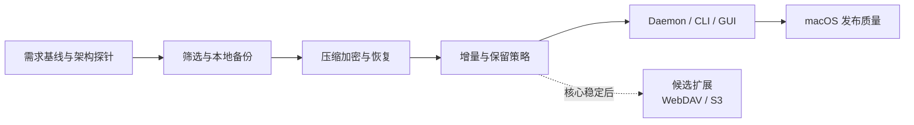

# Data Backup

一款以 macOS 为首发平台、面向个人桌面用户的数据备份软件。项目计划用 Rust 实现备份核心与后台守护进程，用 Svelte 实现桌面图形界面，并提供 CLI 以便自动化和故障排查。

> 项目当前处于代码框架阶段。需求、系统设计和决策记录统一从[架构与设计文档](docs/architecture/README.md)进入。

## 产品目标

- 让用户可以用少量配置创建可靠、可验证、可恢复的本地数据备份。
- 即使 GUI 未运行，计划任务也能由后台守护进程执行。
- GUI、CLI 共用同一个备份核心，保证行为一致。

## MVP 范围

首个版本支持：

- 选择本地文件或目录作为备份源。
- 备份至另一个本地目录或已挂载的外部存储。
- 手动或按每日、每周计划执行备份。
- 增量快照、完整性校验、历史版本浏览与恢复。
- 可预览的文件筛选规则，以及压缩、打包和认证加密。
- 任务状态、运行历史、日志和桌面通知。
- GUI 与 CLI 管理相同的备份任务。

核心闭环稳定后，候选扩展将支持 WebDAV 和 S3 兼容对象存储。移动端、文件实时同步和多用户协作暂不纳入当前版本。

数据默认采用内容定义分块；每块独立进行 Zstandard 压缩，启用加密时再使用 XChaCha20-Poly1305 认证加密，最后聚合进不可变 pack。用户选择安全预设，恢复时由软件自动识别实际算法。详细决策见 [ADR-0008](docs/architecture/decisions/0008-data-transformation.md)。

## 技术方向

- Rust：备份核心、守护进程、CLI。
- Svelte + TypeScript：桌面 GUI。
- SQLite：任务元数据、快照索引和运行历史。
- PlantUML 1.2026.8：标准 UML 用例图、构件图、类图和顺序图；Mermaid：线框图。

桌面壳、快照存储格式及 RPC 方案将在架构验证阶段通过 ADR 决定，不在需求阶段过早锁定。

## 文档

- [产品需求文档](docs/architecture/product-requirements.md)
- [用例模型](docs/architecture/use-cases.md)
- [界面原型](docs/architecture/ui-wireframes.md)
- [架构与逻辑系统设计](docs/architecture/README.md)
- [决策记录](docs/architecture/README.md#架构决策记录)
- [实验报告](docs/report.docx)

实验报告以当前 `docs/report.docx` 为直接排版基准；`docs/report.template.docx` 只保留为课程样式参考。
需求或设计文档更新后，运行：

```shell
uv run scripts/update_report.py
```

用例模型以 `docs/architecture/use-cases.yaml` 为唯一事实来源，逻辑设计以
`docs/architecture/model.yaml` 为唯一事实来源。上述命令会同步生成 Markdown、PlantUML、
SVG、PNG，以及 Word 中的需求与系统设计章节。可分别运行
`uv run scripts/update_use_cases.py --check` 和
`uv run scripts/update_system_design.py --check` 检查生成内容是否漂移。

## 开发环境

当前在 macOS Apple Silicon 上开发，使用 zsh、Apple Command Line Tools 和 LLDB；Intel Mac 在发布阶段补充验证。`rust-toolchain.toml` 固定 Rust 1.98.0、Clippy 和 rustfmt，`Cargo.lock` 固定依赖解析。Rust 2024 edition 用于产品代码；Python 3.12 与 uv 只用于需求、UML 和 Word 报告生成，不进入产品运行时。

Rust workspace 包含 `data-backup-core`、`data-backup-protocol`、`data-backup-daemon` 和 `data-backup-cli`。常用命令：

```shell
cargo build --workspace --all-targets
cargo test --workspace --all-targets
cargo run -p data-backup-cli -- check
cargo run -p data-backup-daemon -- check
uv run scripts/check.py
```

当前依赖 `clap` 解析命令，`serde`/`serde_json` 定义传输无关的状态类型，`thiserror` 表达核心错误，`tracing`/`tracing-subscriber` 向标准错误输出诊断。JSON 自检不代表最终 IPC 已选定 JSON。本阶段不引入异步运行时、SQLite、压缩、加密和远程存储库；在对应业务能力和 ADR 明确后再加入。

调试 Rust 二进制使用 LLDB，未捕获 panic 可用 `RUST_BACKTRACE=1` 查看调用栈；业务错误通过 `Result` 返回。性能分析先用 `/usr/bin/time -l` 建立基线，再按需要用 samply、cargo-flamegraph 或 Xcode Instruments 定位 CPU、内存和 I/O 热点。`profiling` profile 继承 release 优化并保留调试符号：

```shell
cargo build --profile profiling --workspace
samply record ./target/profiling/data-backup check
cargo flamegraph --profile profiling -p data-backup-cli --bin data-backup -- check
```

采样工具可通过 `cargo install --locked samply --version 0.13.1` 和 `cargo install --locked flamegraph --version 0.6.13` 安装。发布构建使用 `cargo build --release --workspace` 并人工验收；桌面应用打包、自启动和签名将在桌面壳 ADR 确定后补充。

## 开发计划

项目按单人、小批量迭代推进，不设置固定日历期限。同一时间只保留一个主要目标；先明确验收标准，再交付可运行增量。恢复正确性、格式兼容和删除安全优先于功能数量。



| 迭代 | 可交付增量 | 完成定义 |
|---|---|---|
| 0 架构风险 | 仓库格式、分块与加密管线、故障探针 | 随机恢复、元数据保密、认证失败、原子提交和崩溃清理得到验证 |
| 1 本地备份 | 扫描、筛选预览、对象写入、快照清单和基础 CLI | 结果可解释，重复执行不重复存储内容 |
| 2 恢复 | 压缩、认证加密、校验、浏览和恢复 | 完成备份—破坏源—恢复—哈希核对；错误口令不输出文件 |
| 3 长期使用 | 增量、保留和垃圾回收 | 清理后保留快照仍可校验和恢复 |
| 4 桌面闭环 | 守护进程、调度、本地 API、GUI 和通知 | GUI 关闭时计划仍执行，核心用例可从 GUI 完成 |
| 5 发布质量 | 安装、升级、自启动、诊断和性能验证 | macOS 发布验收通过 |
| 候选远程目标 | WebDAV 或 S3 适配器 | 网络中断可恢复，未完成上传不产生有效快照 |

当前迭代聚焦 Must 需求评审、macOS 文件元数据恢复预期、仓库格式及 ADR-0008/0009 技术探针，并用大小文件数据集验证中断安全。完成条件是关键选择有可复现证据，仓库探针能写入、提交、发现并清理未完成快照，下一迭代的验收标准明确。

业务闭环稳定后，优先以纯逻辑单元或属性测试检查规则、清单和保留不变量，以临时文件系统集成测试覆盖备份、校验和恢复。故障注入覆盖读取失败、空间不足、目标断开与进程中断；端到端测试只覆盖关键路径。快照格式进入可用版本后，变更需兼容读取或迁移方案；删除、垃圾回收和覆盖恢复在发布前安排独立评审。

## 状态

- [x] 建立 MVP 需求基线
- [x] 建立用例模型与界面低保真原型
- [x] 建立初步架构与项目计划
- [x] 建立 C1、C2、关键容器 C3、部署图、逻辑类图和关键场景顺序图
- [ ] 评审并冻结其余需求基线
- [x] 确认 macOS 为首发平台
- [ ] 完成架构原型和 ADR
- [x] 初始化 Rust 多 crate 工程并通过统一编译
- [ ] 初始化可选的 Svelte 桌面界面

需求和 20 个用例已结构化，可生成 Markdown、UML 和课程报告；当前四个 Rust crate 已能统一编译和执行框架自检。下一步完成高风险技术探针，并实现筛选与本地备份的最小可运行闭环。

## 协作与验证

从最新 `main` 创建短期分支，通过 PR 审查并以 squash merge 合入。当前优先验证可运行框架、自检命令和文档生成；业务闭环稳定后，再围绕备份、校验、恢复等外部行为和关键不变量逐步补充测试。明确的 bug 可先写回归测试，探索性工作不强制 TDD。

远端仓库为 `qi7876/software-development-exp`，目前没有 GitHub Actions 工作流，因此只维护本地 CI，不配置 CD。课程报告以 `docs/report.docx` 为直接排版基准，生成器只修改需求分析和系统设计目标区域。

## License

见 [LICENSE](LICENSE)。
