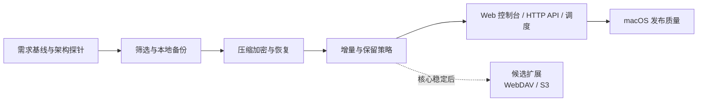

# Data Backup

一款以 macOS 为首发平台、面向个人桌面用户的数据备份软件。产品只发布一个 Rust 可执行文件 `data-backup`，启动后按配置运行 Web 服务器。用户通过内置 Web 控制台管理备份，自动化通过 HTTP API 与 secret key 完成。

> 项目当前处于代码框架阶段。实际架构见[项目架构](docs/architecture/README.md)；课程报告的需求与设计素材见[报告目录](docs/report/README.md)。

## 产品目标

- 让用户可以用少量配置创建可靠、可验证、可恢复的本地数据备份。
- 即使浏览器关闭，计划任务也由同一服务器进程继续执行（计划能力待实现）。
- Web 控制台与 curl 等 API 客户端调用相同的 HTTP 接口，保证行为一致。

## MVP 范围

首个版本支持：

- 选择本地文件或目录作为备份源。
- 备份至另一个本地目录或已挂载的外部存储。
- 手动或按每日、每周计划执行备份。
- 增量快照、完整性校验、历史版本浏览与恢复。
- 可预览的文件筛选规则，以及压缩、打包和认证加密。
- 任务状态、运行历史、日志和桌面通知。
- Web 控制台与 HTTP API 管理相同的备份任务。

核心闭环稳定后，候选扩展将支持 WebDAV 和 S3 兼容对象存储。移动端、文件实时同步和多用户协作暂不纳入当前版本。

课程报告采用内容定义分块、块级 Zstandard 压缩、可选 XChaCha20-Poly1305 认证加密及不可变 pack 的设计方案。实际实现以代码和技术验证结果为准。

## 技术方向

- Rust：单一 package 与二进制，包含服务器、API 类型及备份业务逻辑。
- [Axum](https://docs.rs/axum/0.8.9/axum/) + [Tokio](https://docs.rs/tokio/latest/tokio/)：HTTP 路由、异步网络及信号处理。
- HTML + JavaScript：当前 Web 控制台通过 `include_str!` 编译进二进制；无需独立前端服务或桌面壳。
- SQLite（计划中）：任务元数据、快照索引和运行历史。
- Mermaid：项目架构中的简明视图；PlantUML 1.2026.8：课程报告所需的 UML 图。

服务器、接口类型与后续备份逻辑位于同一进程，无本地 IPC。快照存储格式将在技术验证后决定。

## 文档

- [项目架构 C1/C2](docs/architecture/README.md)
- [课程报告资料](docs/report/README.md)
- 实验报告：本地 `docs/report/report.docx`（不纳入 Git）

实验报告以当前 `docs/report/report.docx` 为直接排版基准；`docs/report/report.template.docx` 只保留为课程样式参考。
报告素材更新后，运行：

```shell
uv run scripts/update_report.py
```

报告用例模型以 `docs/report/use-cases.yaml` 为来源，报告逻辑设计以
`docs/report/model.yaml` 为来源。上述命令会同步生成报告使用的 PNG，
以及 Word 中的需求与系统设计章节。可分别运行
`uv run scripts/update_use_cases.py --check` 和
`uv run scripts/update_system_design.py --check` 检查生成内容是否漂移。完整报告资料检查使用 `uv run scripts/check.py --report`。

## 开发环境

当前在 macOS Apple Silicon 上开发，使用 zsh、Apple Command Line Tools 和 LLDB；Intel Mac 在发布阶段补充验证。`rust-toolchain.toml` 固定 Rust 1.98.0、Clippy 和 rustfmt，`Cargo.lock` 固定依赖解析。Rust 2024 edition 用于产品代码；Python 3.12 与 uv 只用于需求、UML 和 Word 报告生成，不进入产品运行时。

项目只有一个 Cargo package `data-backup` 和一个同名二进制。常用命令：

```shell
cargo build --all-targets
cargo test --all-targets
uv run scripts/check.py
```

当前使用 `serde`/`serde_json` 解析配置和输出 API JSON，`thiserror` 表达配置错误，`tracing`/`tracing-subscriber` 向标准错误输出诊断。备份、恢复、调度、持久化、压缩、加密和远程存储尚未实现。按需增加有实际行为的模块，不预先建立空的分层目录或独立共享库。

## 启动与使用

创建配置并设置随机 secret key（只需一次；已有文件不会被覆盖）：

```shell
umask 077
python3 - <<'PYCONFIG'
import json
import secrets

with open("config.json", "x") as config:
    json.dump({"listen": "127.0.0.1:8080", "secret_key": secrets.token_hex(32)}, config, indent=2)
PYCONFIG
cargo run
```

也可将 `data-backup.example.json` 复制为工作目录下的 `config.json`，并填写 `secret_key`。示例中的空 key 会被拒绝。Python 仅用于上述一次性配置生成，服务器运行只需 Rust 二进制与配置文件。`config.json` 已加入 `.gitignore`。

程序支持三个启动 flag，不提供业务子命令：

| 参数 | 用途 |
|---|---|
| `--version` / `-v` | 输出软件版本并退出。 |
| `--help` / `-h` | 输出使用帮助、配置字段说明和示例后退出。 |
| `--working-directory <PATH>` / `-d <PATH>` | 设置进程工作目录，并读取该目录下的 `config.json`。 |

默认工作目录为启动时的当前目录；相对目录参数以启动时的目录为基准解析，后续相对路径以设置后的工作目录为基准。支持 `--working-directory=<PATH>`；路径含空格时使用引号。

```shell
./target/debug/data-backup --version
./target/debug/data-backup --help
./target/debug/data-backup -d /path/to/backups
cargo run -- --working-directory "/path/with spaces"
```

`--help` 和 `--version` 不读取配置或启动服务器。未知参数和缺失的目录参数以退出码 2 报错；目录不存在、目录参数指向普通文件或配置加载失败时，以非零状态退出。原 `DATA_BACKUP_CONFIG` 环境变量不再使用，旧 `data-backup.json` 应改名为工作目录下的 `config.json`。

配置只在启动时读取；修改后需重启。`listen` 必须是 IP:port（IPv6 使用 `[::1]:8080`），`secret_key` 必须非空且只包含不带空格的可见 ASCII 字符；建议用随机生成的 key。未知字段、缺失字段、配置读取失败或端口占用都会使程序以非零状态退出；诊断不会输出 secret key。Ctrl-C 或 SIGTERM 会停止接收连接并等待当前 HTTP 请求结束。

打开 <http://127.0.0.1:8080/>，输入配置中的 secret key，再点击 Connect / refresh 查看服务器状态。页面只在内存保存 key，刷新、关闭或 Disconnect 后清除。控制台 HTML 可公开获取，但所有 `/api/` 请求必须携带 `Authorization: Bearer <secret_key>`；key 不放在 URL 或响应中。

curl 使用相同接口，将 `YOUR_SECRET_KEY` 换为配置中的 key：

```shell
curl --fail-with-body \
  -H 'Authorization: Bearer YOUR_SECRET_KEY' \
  http://127.0.0.1:8080/api/status
```

当前 API：

| 请求 | 结果 |
|---|---|
| `GET /` | 内置 Web 控制台。 |
| `GET /api/status` | 已认证时返回 `{"status":"ok","package_version":"0.1.0","backup_available":false}`。 |
| 缺失、错误或重复的 Authorization header | `401` JSON 错误与 `WWW-Authenticate: Bearer`。 |
| 已认证但不存在的 `/api/` 路径 | `404` JSON 错误。 |

当前只实现服务器框架与状态查询，尚不能实际备份或恢复；后续管理功能直接扩展同一 API 和控制台。HTTP 服务无内置 TLS，默认配置绑定 loopback；远程访问应由 HTTPS 反向代理提供传输加密。secret key 控制 API 访问，不是备份数据的加密口令。

调试 Rust 二进制使用 LLDB，未捕获 panic 可用 `RUST_BACKTRACE=1` 查看调用栈；业务错误通过 `Result` 返回。性能分析先用 `/usr/bin/time -l` 建立基线，再按需要用 samply、cargo-flamegraph 或 Xcode Instruments 定位 CPU、内存和 I/O 热点。`profiling` profile 继承 release 优化并保留调试符号：

```shell
cargo build --profile profiling
samply record ./target/profiling/data-backup
cargo flamegraph --profile profiling --bin data-backup
```

采样工具可通过 `cargo install --locked samply --version 0.13.1` 和 `cargo install --locked flamegraph --version 0.6.13` 安装。发布构建使用 `cargo build --release` 并人工验收，只发布 `target/release/data-backup`。安装、自启动和签名将在发布阶段补充。

## 开发计划

项目按单人、小批量迭代推进，不设置固定日历期限。同一时间只保留一个主要目标；先明确验收标准，再交付可运行增量。恢复正确性、格式兼容和删除安全优先于功能数量。



| 迭代 | 可交付增量 | 完成定义 |
|---|---|---|
| 0 架构风险 | 仓库格式、分块与加密管线、故障探针 | 随机恢复、元数据保密、认证失败、原子提交和崩溃清理得到验证 |
| 1 本地备份 | 扫描、筛选预览、对象写入、快照清单和基础 HTTP API | 结果可解释，重复执行不重复存储内容 |
| 2 恢复 | 压缩、认证加密、校验、浏览和恢复 | 完成备份—破坏源—恢复—哈希核对；错误口令不输出文件 |
| 3 长期使用 | 增量、保留和垃圾回收 | 清理后保留快照仍可校验和恢复 |
| 4 管理闭环 | 同进程调度、HTTP API、Web 控制台和通知 | 浏览器关闭时计划仍执行，核心用例可从 Web 控制台或 curl 完成 |
| 5 发布质量 | 安装、升级、自启动、诊断和性能验证 | macOS 发布验收通过 |
| 候选远程目标 | WebDAV 或 S3 适配器 | 网络中断可恢复，未完成上传不产生有效快照 |

当前迭代聚焦本地备份需求、macOS 文件元数据恢复预期、仓库格式、数据管线与筛选规则技术探针，并用大小文件数据集验证中断安全。完成条件是关键选择有可复现证据，仓库探针能写入、提交、发现并清理未完成快照，下一迭代的验收标准明确。

业务闭环稳定后，优先以纯逻辑单元或属性测试检查规则、清单和保留不变量，以临时文件系统集成测试覆盖备份、校验和恢复。故障注入覆盖读取失败、空间不足、目标断开与进程中断；端到端测试只覆盖关键路径。快照格式进入可用版本后，变更需兼容读取或迁移方案；删除、垃圾回收和覆盖恢复在发布前安排独立评审。

## 状态

- [x] 建立 MVP 需求基线
- [x] 建立用例模型与界面低保真原型
- [x] 建立初步架构与项目计划
- [x] 建立 C1、C2 项目架构视图；课程报告图表独立存放
- [ ] 评审并冻结其余需求基线
- [x] 确认 macOS 为首发平台
- [ ] 完成仓库格式等关键技术探针
- [x] 合并为单一 Rust package 与服务器二进制，移除 CLI
- [x] 实现配置启动、内置 Web 控制台与 secret key 认证的状态 API
- [ ] 实现 Web 控制台与 API 的备份管理闭环

需求和 20 个用例已结构化，可生成 Markdown、UML 和课程报告；当前单一 Rust 二进制已能按配置启动 HTTP 服务，Web 控制台与 curl 共用认证 API。报告素材保留早期预设设计，不代表当前实现边界。下一步完成高风险技术探针，并实现筛选与本地备份的最小可运行闭环。

## 协作与验证

从最新 `main` 创建短期分支，通过 PR 审查并以 squash merge 合入。当前验证配置错误、认证边界、状态 API、实际 HTTP 启动与信号退出，报告生成单独检查；业务闭环稳定后，再围绕备份、校验、恢复等外部行为和关键不变量逐步补充测试。明确的 bug 可先写回归测试，探索性工作不强制 TDD。

远端仓库为 `qi7876/software-development-exp`，目前没有 GitHub Actions 工作流，因此只维护本地 CI，不配置 CD。课程报告以 `docs/report/report.docx` 为直接排版基准，生成器只修改需求分析和系统设计目标区域。

## License

见 [LICENSE](LICENSE)。
