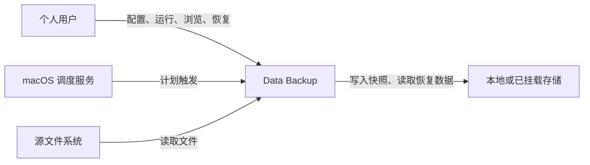

# C1 系统上下文

Data Backup 面向 macOS 个人用户，提供本地数据备份与恢复能力。当前仓库只有 Rust 框架和自检命令；下图中的备份、恢复与调度交互是目标行为。

| 外部角色或系统 | 关系 |
|---|---|
| 个人用户 | 创建任务、查看状态、执行备份和恢复；高级用户可使用 CLI。 |
| macOS 调度服务 | 在计划时间触发后台任务；尚未接入。 |
| 源文件系统 | 提供需要保护的文件与元数据。 |
| 本地或已挂载存储 | 保存快照并提供恢复数据；远程目标是后续候选能力。 |

系统负责在失败或中断后保留已提交快照，并明确报告错误。具体实现和当前进度以代码与根目录 [README](../../README.md) 为准。
