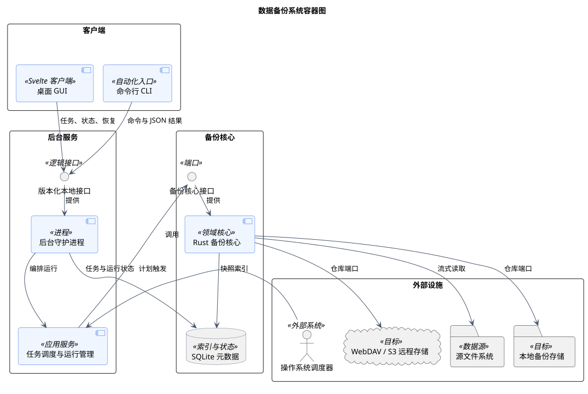

# C2 容器设计

> 版本 1.1；更新日期 2026-09-18。

本文档由 `model.yaml` 生成；维护范围见[架构入口](README.md)。

## 数据备份系统容器图

图 1 数据备份系统容器图

该图从进程和外部系统边界说明桌面端、命令行、后台服务、备份核心及存储设施的协作方式。GUI 与 CLI 均通过同一版本化本地接口访问后台服务，核心逻辑不依赖具体交互端。

| 元素 | 职责 |
|---|---|
| 桌面 GUI / CLI | 提供交互和自动化入口，不直接修改仓库或 SQLite。 |
| 版本化本地接口 | 统一客户端协议、事件流、错误语义和兼容性协商。 |
| 后台守护进程 | 管理任务生命周期、计划触发、互斥、进度和通知。 |
| Rust 备份核心 | 实现扫描、变换、快照、校验、恢复和保留清理。 |
| SQLite 元数据 | 保存任务、运行、快照索引和校验结果，不保存用户文件内容。 |
| 源与目标存储 | 通过端口提供源文件读取及本地、WebDAV、S3 仓库访问。 |

关系与交互说明：

- GUI 和 CLI 依赖同一本地接口，因此后台运行不会因 GUI 退出而中止。
- 操作系统调度器只触发计划，具体互斥、重试和状态转换由后台服务负责。
- 备份核心经统一仓库端口访问本地或远程目标，远程协议细节不得进入领域逻辑。
- SQLite 保存可重建的控制面元数据，备份内容和清单位于备份仓库。

关键约束：

- 客户端、API、数据库和仓库格式必须显式版本化。
- 同一任务不能并发执行两个修改仓库的操作。
- 日志、状态事件和诊断包不得包含口令、主密钥或用户文件内容。

追踪关系：用例：UC-01、UC-02、UC-03、UC-04、UC-05、UC-06、UC-07、UC-08、UC-16；功能需求：FR-01、FR-02、FR-03、FR-04、FR-05、FR-06、FR-07、FR-08、FR-09、FR-10、FR-11、FR-12、FR-13、FR-16；非功能需求：NFR-01、NFR-03、NFR-04、NFR-05、NFR-06、NFR-07、NFR-08、NFR-09、NFR-10。

PlantUML 固定版本：1.2026.8；SHA-256：`5e1ecfa8ecd32c90b03bbf3b1eb6f020943f98ab0fcf4032be31a0002ee2c462`。
