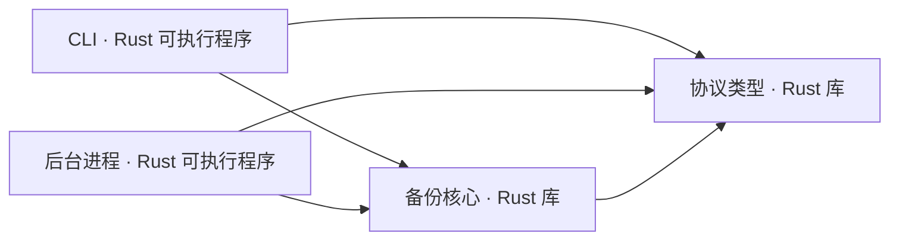

# C2 容器

当前 workspace 有两个可运行程序和两个共享库。CLI 与 daemon 现在只提供版本信息和 JSON 框架自检；本地 IPC、调度服务、SQLite、备份存储和桌面 GUI 尚未实现。

| 单元 | 当前职责 | 后续边界 |
|---|---|---|
| `data-backup-cli` | 解析命令并输出自检结果。 | 管理任务、触发备份与恢复；与 daemon 的通信方式待定。 |
| `data-backup-daemon` | 提供后台进程入口与自检结果。 | 承担调度和长时间运行的任务，GUI 退出后继续执行。 |
| `data-backup-core` | 定义领域标识、错误、协议版本检查及模块边界。 | 实现扫描、筛选、快照、校验与恢复，共供 CLI 和 daemon 使用。 |
| `data-backup-protocol` | 定义版本化、传输无关的共享状态类型。 | 承载进程间接口契约；具体 IPC 形式尚未选择。 |

桌面 GUI 计划采用 Svelte + TypeScript；它尚未加入仓库。SQLite、本地仓库与外部存储的连接关系会在实现时补充。备份核心若形成需要独立说明的复杂接口，再增加 C3 文档。
