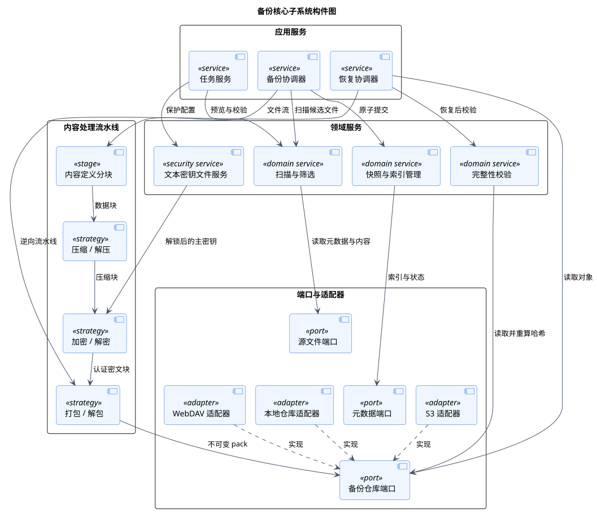

# C3 备份核心构件

> 版本 1.1；更新日期 2026-09-18。

本文档由 `model.yaml` 生成；维护范围见[架构入口](README.md)。

## 备份核心子系统构件图

图 1 备份核心子系统构件图

该图细化备份核心内部的应用服务、内容处理流水线和端口适配器。所有可替换算法与外部存储均位于稳定接口之后，以便独立测试和逐步接入远程目标。

| 元素 | 职责 |
|---|---|
| 任务服务 | 管理任务配置、筛选预览、保护配置和保存前校验。 |
| 备份 / 恢复协调器 | 编排长时间运行流程、取消点、失败隔离和状态报告。 |
| 扫描与筛选 | 对预览和正式备份执行同一套有序规则。 |
| 内容处理流水线 | 写入按分块、压缩、加密、打包执行，读取严格逆序。 |
| 文本密钥文件服务 | 创建和读取版本化 JSON 密钥文件，仅向加密策略提供内存中的主密钥。 |
| 仓库端口与适配器 | 统一对象读写、列举、临时上传、原子提交及能力探测。 |

关系与交互说明：

- 任务服务在保存任务前编译筛选规则并验证源、目标、调度和算法组合。
- 备份写入顺序固定为分块、压缩、可选认证加密、打包；恢复按相反顺序读取。
- 快照服务只在全部 pack 和清单可读取后发布提交标记，再写入成功状态。
- 本地、WebDAV 和 S3 适配器实现同一仓库端口，核心只依赖端口能力。

关键约束：

- 每个块必须记录格式、压缩算法、加密算法和版本。
- 未知的必需算法必须拒绝读取，不得猜测或静默降级。
- 错误口令、损坏密钥文件或认证失败不得输出最终明文。

追踪关系：用例：UC-01、UC-02、UC-04、UC-05、UC-06、UC-07、UC-09、UC-10、UC-11、UC-12、UC-13、UC-14、UC-14L、UC-14R、UC-15、UC-16、UC-17、UC-18；功能需求：FR-01、FR-02、FR-04、FR-05、FR-06、FR-07、FR-08、FR-10、FR-13、FR-14、FR-15、FR-16；非功能需求：NFR-01、NFR-02、NFR-03、NFR-04、NFR-07、NFR-10、NFR-11、NFR-12、NFR-13。

PlantUML 固定版本：1.2026.8；SHA-256：`5e1ecfa8ecd32c90b03bbf3b1eb6f020943f98ab0fcf4032be31a0002ee2c462`。
