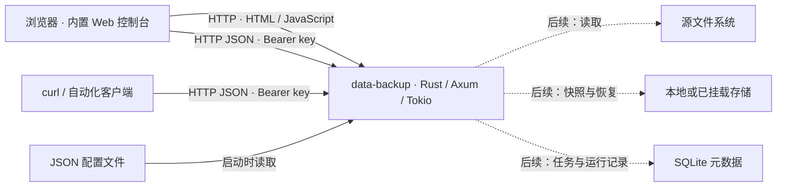

# C2 容器

产品只发布一个 `data-backup` 二进制。唯一的产品服务进程加载配置并运行 Axum/Tokio HTTP 服务器；Web 控制台的 HTML 与 JavaScript 编译进二进制，没有独立前端服务、CLI、daemon 可执行文件或共享协议 crate。

| 运行单元 | 当前职责 | 后续能力 |
|---|---|---|
| `data-backup` | 读取 `listen` 与 `secret_key` 配置；提供控制台、认证 API、JSON 状态和错误；响应 SIGINT/SIGTERM。 | 在同一进程内实现备份、恢复、调度、元数据与仓库存储。 |
| 浏览器 | 加载内置控制台；在页面内存中持有用户输入的 key；通过 API 查看服务器状态。 | 通过同一 API 管理任务、运行、快照和恢复。 |
| curl / 自动化客户端 | 使用 Authorization Bearer header 调用状态 API。 | 通过与控制台相同的接口执行备份管理。 |

`GET /` 返回不含 key 的控制台；所有 `/api/` 请求经过同一认证中间件。当前 `GET /api/status` 只报告服务器状态、package 版本及 `backup_available: false`；未知 API 返回明确错误。响应不缓存，key 不写入 URL、日志或响应。

配置仅启动时读取，文件名固定为工作目录下的 `config.json`；默认工作目录是启动时的当前目录，`--working-directory` / `-d` 会切换进程目录。`--help` / `-h` 输出帮助和配置手册，`--version` / `-v` 输出版本，两者直接退出，不读取配置或启动服务。原 `DATA_BACKUP_CONFIG` 不再使用；目录错误、端口冲突及无效配置使启动失败。默认示例监听 loopback，HTTP 服务无内置 TLS，远程访问通过 HTTPS 反向代理提供传输加密。当前只提供共享 secret key 认证，无多用户权限模型。

同一进程中的业务调用使用普通 Rust 调用，无跨进程兼容检查。未来的 API 类型与业务代码仍放在同一 package 中，接口稳定后再按实际需要决定版本策略。
