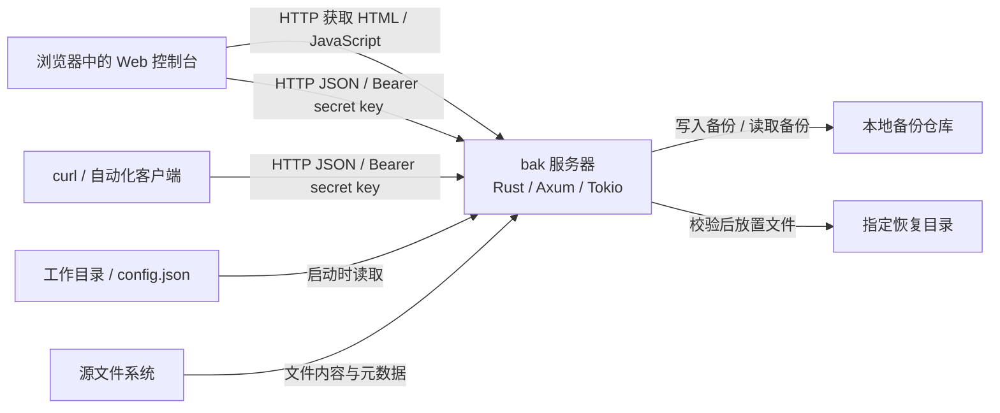

# C2 容器设计

状态：待共同评审的目标设计，产品当前仅有空入口。

计划只发布一个 `bak` 二进制，运行一个 Rust 服务器进程。Web 控制台的 HTML 与 JavaScript 随二进制分发，在浏览器中执行；控制台与 curl 都通过 HTTP API 访问同一个服务器。备份、恢复及后续调度在服务器进程内完成。

所有连接表示待实现的交互。Axum 与 Tokio 沿用前一阶段的技术方向，在写 HTTP 服务时再引入依赖；图中的文件和目录是数据存储，不代表额外服务进程。

| 运行单元 | 目标职责 |
|---|---|
| `bak` 服务器 | 处理启动参数与配置，提供控制台和认证 API，在同一进程内执行备份与恢复并返回明确结果。 |
| 浏览器中的 Web 控制台 | 接收用户输入，通过统一 API 管理操作并展示结果；不直接访问服务器文件系统。 |
| curl / 自动化客户端 | 携带 secret key 调用同一 API，以 JSON 处理结果与错误。 |

## 启动与配置边界

| 参数 | 目标行为 |
|---|---|
| `--version` / `-v` | 显示版本后退出。 |
| `--help` / `-h` | 显示帮助与配置手册后退出。 |
| `--working-directory <PATH>` / `-d <PATH>` | 设置工作目录，读取其中的 `config.json`。 |

不指定目录时使用启动时的当前目录；帮助和版本不读取配置、不启动服务器。配置在启动时读取，修改后通过重启生效。目录、配置或监听端口不可用时，启动应以非零状态失败，并说明原因。

`config.json` 保留两个启动字段：`listen` 指定监听地址，`secret_key` 指定 API 访问凭据。它与未来的备份任务配置、仓库信息分别维护。[示例工作目录](../../working-directory-example/config.json)仅提供设计样例，当前空程序不读取配置。

## 通信与数据边界

控制台页面可公开获取，业务 API 必须使用 `Authorization: Bearer <secret_key>` 认证；key 不放在 URL、日志或响应中。控制台的 key 只保存在页面内存。默认监听本地 loopback，HTTP 服务不提供内置 TLS，远程访问由 HTTPS 反向代理提供传输加密。

所有文件路径指向服务器可访问的文件系统，而非浏览器所在设备。源文件用于读取；备份仓库保存可独立恢复的内容与必要信息；恢复目录接收校验成功的文件。任务和运行记录的持久化方式尚未决定，不预先增加数据库容器。

服务器内使用普通 Rust 调用；API 类型、路由和业务代码属于同一 Cargo package。按真实职责增加模块，多个调用方出现稳定共用模式后再考虑抽象。后续计划任务由同进程调度，服务器退出后不再执行。

## 接下来共同决定

- 第一条业务闭环需要保存哪些文件信息，如何识别一次成功备份。
- 最简单的仓库格式，以及失败或中断时如何保护已有数据。
- 最小 HTTP API 的请求、响应和错误；先实现哪些行为才能获得快速反馈。

这些问题在相应步骤中用样例和执行结果验证，不以课程报告的类图或流水线接口提前约束实现。
