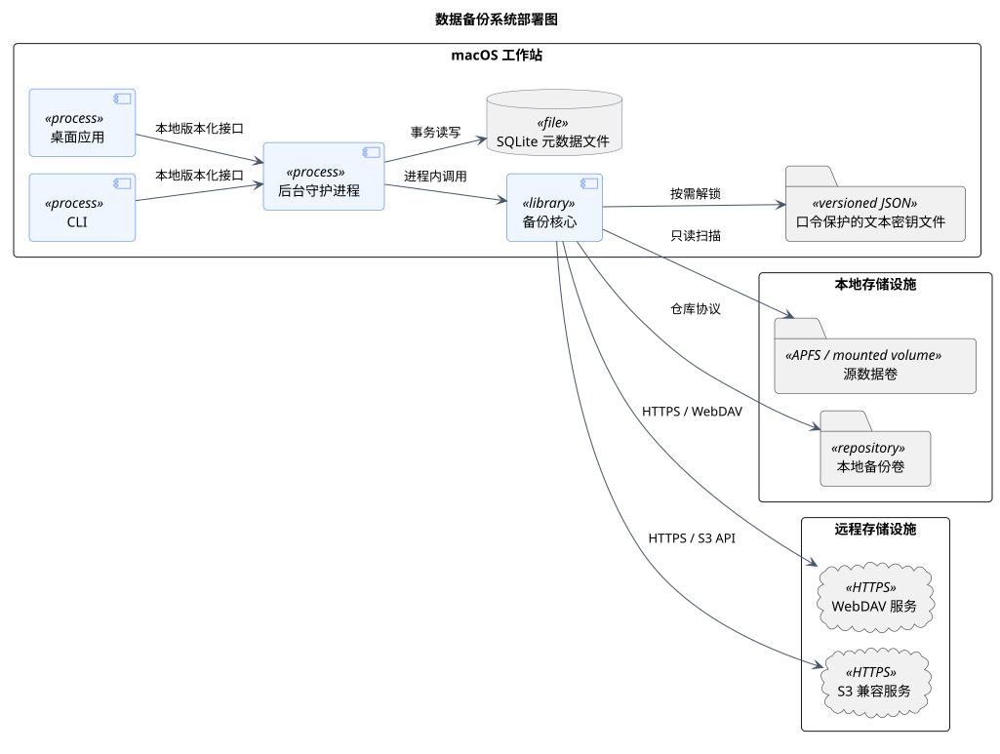

# 部署视图

> 版本 1.1；更新日期 2026-09-18。

本文档由 `model.yaml` 生成；维护范围见[架构入口](README.md)。

## 数据备份系统部署图

图 1 数据备份系统部署图

该图说明首发 macOS 部署拓扑及本地、远程数据边界。桌面应用、CLI、后台守护进程和备份核心运行在同一工作站，控制面数据写入 SQLite，受口令保护的文本密钥文件由用户保管。

| 元素 | 职责 |
|---|---|
| macOS 工作站 | 承载交互端、后台运行时、核心逻辑和本地控制面数据。 |
| 文本密钥文件 | 保存认证加密后的主密钥、KDF 参数和密钥标识，不保存口令。 |
| 本地存储设施 | 提供源数据卷和可选的本地备份仓库。 |
| 远程存储设施 | 通过 HTTPS 提供 WebDAV 或 S3 兼容对象持久化。 |

关系与交互说明：

- GUI 退出不终止守护进程中的备份或恢复运行。
- SQLite 是控制面元数据，不替代备份仓库中的快照清单和内容对象。
- 远程适配器必须将超时、认证、容量和一致性错误转换为明确的领域错误。

关键约束：

- 本地接口不得对非本机网络开放。
- 密钥文件权限应限制为当前用户，口令和明文主密钥仅短暂存在于内存。
- 远程传输必须使用经过证书验证的 HTTPS。

追踪关系：用例：UC-01、UC-02、UC-03、UC-04、UC-05、UC-06、UC-08、UC-14、UC-14L、UC-14R、UC-15；功能需求：FR-01、FR-02、FR-03、FR-04、FR-06、FR-07、FR-08、FR-10、FR-13、FR-14、FR-15、FR-16；非功能需求：NFR-01、NFR-02、NFR-03、NFR-04、NFR-05、NFR-06、NFR-07、NFR-08、NFR-10、NFR-11、NFR-12、NFR-13。

PlantUML 固定版本：1.2026.8；SHA-256：`5e1ecfa8ecd32c90b03bbf3b1eb6f020943f98ab0fcf4032be31a0002ee2c462`。
