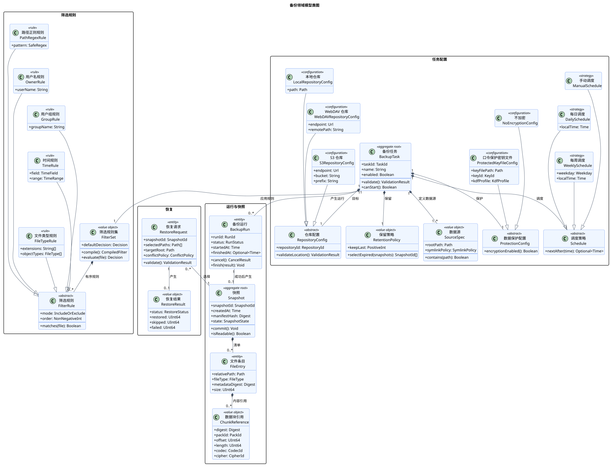
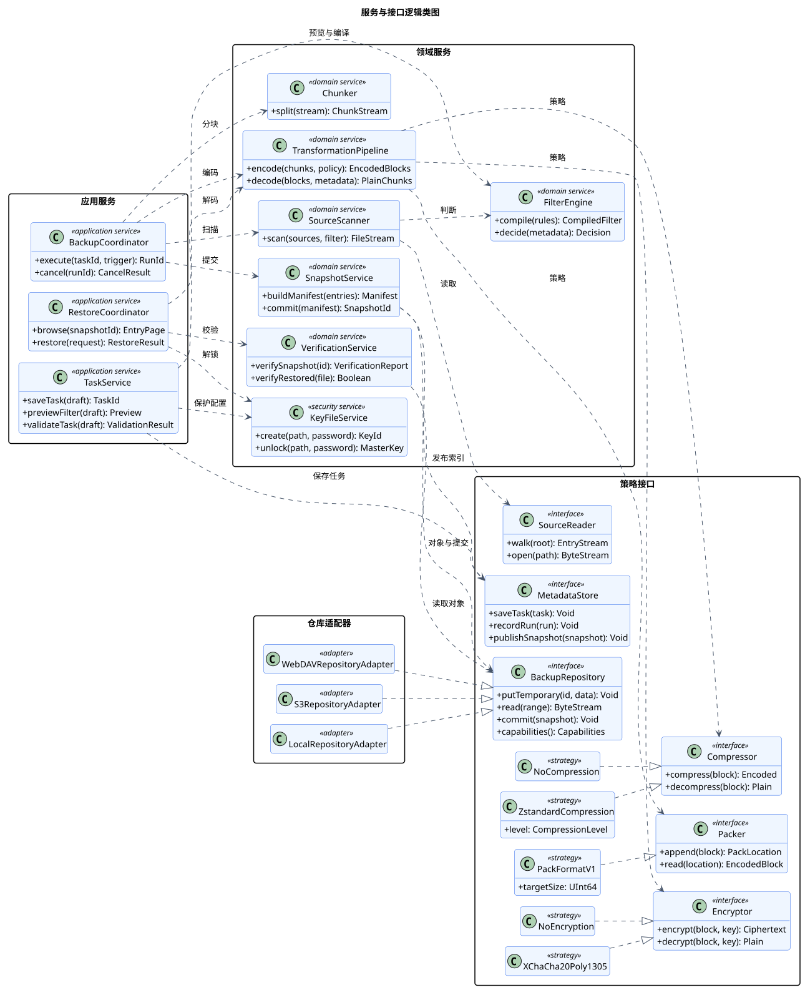

# 逻辑类模型

> 版本 1.1；更新日期 2026-09-18。

本文档由 `model.yaml` 生成；维护范围见[架构入口](README.md)。

## 备份领域模型类图

图 1 备份领域模型类图

该图描述任务配置、运行、快照内容和恢复请求之间的稳定业务关系。组合关系用于表达生命周期所有权，泛化关系用于表达可替换的调度、筛选、保护和仓库配置。

| 元素 | 职责 |
|---|---|
| BackupTask | 任务配置聚合根，维护源、筛选、调度、保留、保护和仓库配置的一致性。 |
| FilterSet / FilterRule | 保存有序包含/排除规则，并支持路径、用户、组、时间和文件类型特化。 |
| BackupRun | 记录一次执行的状态、统计、取消和失败信息。 |
| Snapshot / FileEntry / ChunkReference | 表示不可变快照、目录清单和内容寻址块引用。 |
| RepositoryConfig | 抽象本地、WebDAV 和 S3 的连接及目标位置配置。 |
| RestoreRequest / RestoreResult | 描述恢复选择、目标、冲突策略及最终逐项统计。 |

关系与交互说明：

- BackupTask 对任务配置对象使用组合关系，删除任务配置不会默认删除独立存在的已提交快照。
- BackupRun 只有在原子提交成功后才关联一个 Snapshot，取消或失败运行不产生成功快照。
- Snapshot 组合文件条目，文件条目组合按顺序排列的数据块引用；实际块可被多个快照复用。
- 筛选、调度、保护和仓库配置使用泛化表达合法变体，不把算法内部步骤建模为领域实体。

关键约束：

- 快照一经提交即不可变，清单只引用已经完整写入的块和 pack。
- FilterSet 必须在保存任务时完成规则编译与复杂度校验。
- ProtectedKeyFileConfig 只保存密钥文件位置、密钥标识和 KDF 配置，不保存口令或主密钥。

追踪关系：用例：UC-01、UC-02、UC-03、UC-05、UC-06、UC-07、UC-09、UC-10、UC-11、UC-12、UC-13、UC-14、UC-14L、UC-14R、UC-15、UC-16、UC-17、UC-18；功能需求：FR-01、FR-02、FR-03、FR-04、FR-05、FR-06、FR-08、FR-09、FR-10、FR-13、FR-14、FR-15、FR-16；非功能需求：NFR-01、NFR-02、NFR-05、NFR-10、NFR-11、NFR-12、NFR-13。

## 服务与接口逻辑类图

图 2 服务与接口逻辑类图

该图描述应用服务、领域服务、算法策略及存储端口之间的依赖倒置关系。接口只表达稳定能力，不绑定同步或异步调用形式，也不等同于最终 Rust trait 的完整签名。

| 元素 | 职责 |
|---|---|
| TaskService | 协调任务草稿校验、筛选预览、密钥文件创建和配置持久化。 |
| BackupCoordinator | 执行备份状态机并在安全点响应取消。 |
| RestoreCoordinator | 浏览快照、处理冲突、解码、校验并原子放置恢复文件。 |
| TransformationPipeline | 按记录在块元数据中的策略完成编码和逆向解码。 |
| BackupRepository | 定义本地与远程仓库共同需要的临时写入、读取、提交和能力接口。 |
| 算法策略 | 压缩、加密与打包实现可替换，读取端按格式标识选择实现。 |

关系与交互说明：

- 应用服务仅依赖领域服务和接口，适配器通过实现接口接入，形成端口与适配器结构。
- TransformationPipeline 聚合 Compressor、Encryptor 和 Packer 策略，但不决定用户界面中的预设名称。
- NoCompression 与 Zstandard、NoEncryption 与 XChaCha20-Poly1305 是当前已确认的逻辑实现变体。
- Repository 的能力探测用于处理本地原子重命名与远程临时对象提交之间的差异。

关键约束：

- 接口签名是逻辑契约，不预先决定 Rust trait 的异步、生命周期或错误类型。
- 恢复时必须由块元数据选择解压和解密实现，不能依赖当前任务默认值。
- 远程适配器必须实现超时、有界重试和未提交对象清理。

追踪关系：用例：UC-01、UC-02、UC-04、UC-05、UC-06、UC-07、UC-09、UC-10、UC-11、UC-12、UC-13、UC-14、UC-14L、UC-14R、UC-15、UC-16、UC-17、UC-18；功能需求：FR-01、FR-02、FR-04、FR-05、FR-06、FR-07、FR-08、FR-10、FR-13、FR-14、FR-15、FR-16；非功能需求：NFR-01、NFR-02、NFR-04、NFR-07、NFR-10、NFR-11、NFR-12、NFR-13。

PlantUML 固定版本：1.2026.8；SHA-256：`5e1ecfa8ecd32c90b03bbf3b1eb6f020943f98ab0fcf4032be31a0002ee2c462`。
