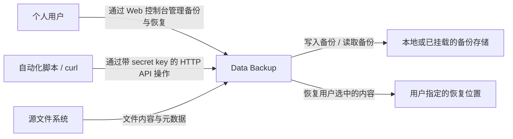

# C1 系统上下文

Data Backup 面向 macOS 个人用户，负责把本地文件保存为可验证、可恢复的备份，并在用户需要时恢复到指定位置。个人用户通过浏览器中的 Web 控制台操作；自动化脚本通过 curl 等 HTTP 客户端操作。两者使用同一系统和相同的访问凭据。

| 外部角色或系统 | 与 Data Backup 的关系 |
|---|---|
| 个人用户 | 配置备份来源与目标，发起备份，查看结果，选择要恢复的内容及位置。 |
| 自动化脚本 / curl | 使用 secret key 调用 HTTP API，获得与 Web 控制台一致的结果和错误。 |
| 源文件系统 | 提供文件及元数据；备份操作不修改源文件。 |
| 本地或已挂载的备份存储 | 保存备份内容与识别、校验和恢复所需的信息。 |
| 用户指定的恢复位置 | 接收恢复文件，可能与源位置相同；覆盖已有文件必须明确确认。 |

系统负责执行与记录操作；浏览器仅用于管理，关闭浏览器不应中止服务器中的运行。访问控制使用共享 secret key，目标为个人使用，不包含多用户权限管理。

## 第一条业务闭环（建议，待确认）

先完成单个本地源到单个本地目标的手动备份，再将备份恢复到另一个目录并比较内容。成功结果必须可验证；失败或中断必须报告明确原因，并保持原文件和已有成功备份可用。

计划任务、增量、保留策略、文件筛选、压缩和仓库加密随后逐项讨论。WebDAV / S3 属于本地闭环稳定后的候选扩展；移动端、实时同步和多人协作不纳入当前方向。API secret key 用于访问控制，与未来的备份加密口令独立。

评审时先确认上述最小闭环是否足够，以及“源”“备份存储”“恢复位置”三者的边界。进程与存储的具体划分见 [C2](containers.md)。
