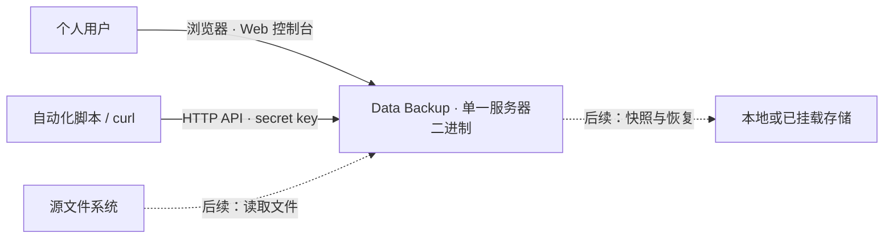

# C1 系统上下文

Data Backup 面向 macOS 个人用户，目标是可靠的本地备份与恢复。用户通过浏览器中的 Web 控制台管理数据，自动化通过 curl 等 HTTP 客户端与 secret key 调用相同 API。服务器独立于浏览器运行。

| 外部角色或系统 | 关系 |
|---|---|
| 个人用户 | 在浏览器输入 key 后查看状态；任务管理、备份与恢复待实现。 |
| 自动化脚本 / curl | 在 Authorization Bearer header 中携带相同 key，调用 HTTP API；无需专用 CLI。 |
| 源文件系统 | 将为备份提供文件与元数据；尚未接入。 |
| 本地或已挂载存储 | 将保存快照并提供恢复数据；尚未接入，远程目标是后续候选能力。 |

计划任务将由同一服务器进程执行，浏览器关闭后仍继续；调度当前尚未实现。备份实现需在失败或中断后保留已提交快照，并明确报告错误。当前进度与使用方式见根目录 [README](../../README.md)。
