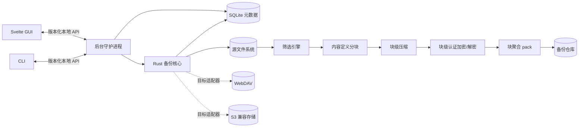

# 初步架构

本文档只定义需求阶段的组件边界，不替代后续架构决策记录（ADR）。



## 组件职责

- 备份核心：扫描、差异判断、内容写入、快照提交、校验、恢复和保留清理；不依赖 GUI。
- 守护进程：任务编排、计划调度、互斥、生命周期、事件流与通知。
- GUI：配置、状态展示、快照浏览和恢复交互；不直接修改仓库数据。
- CLI：自动化与诊断入口；与 GUI 使用相同 API。
- SQLite：任务、运行、快照索引和校验结果；用户实际备份内容放在备份仓库中。
- 目标适配器：统一本地目录、WebDAV 与 S3 的对象读写、列举、提交和能力探测；远程实现安排在本地闭环之后。
- 筛选引擎：编译并执行有序 include/exclude 规则，提供扫描预览；备份与预览共用实现。
- 数据变换管线：内容定义分块后，每块独立使用 Zstandard 压缩；启用加密时再使用 XChaCha20-Poly1305 认证加密，最后将块聚合进不可变 pack；读取方向严格逆序。
- 密钥管理：仓库使用随机主密钥，口令经 Argon2id 派生保护密钥；版本化 JSON 文本密钥文件认证封装主密钥，并保存 Base64 编码的 KDF 参数、盐、nonce、密文主密钥和密钥标识。
- 元数据保护：启用加密时，文件名、目录结构、文件元数据、快照清单和 pack 索引均认证加密；未解锁仓库只暴露格式识别和解锁必需信息。

## 必须保持的系统不变量

1. 已提交快照不可变，并且任何时刻都只引用已经完整写入的内容对象。
2. 删除未提交运行或过期快照不会影响仍被保留快照引用的内容。
3. 同一任务不能同时执行两个会修改仓库的操作。
4. 客户端断开不会终止守护进程中的运行。
5. API、数据库和仓库格式均有显式版本；不兼容变更必须提供迁移或拒绝打开。
6. 未通过认证的密文绝不成为最终恢复文件；密钥不进入日志、缓存状态或诊断包。
7. 筛选预览和正式备份对同一任务、同一文件系统状态必须给出相同判断。
8. 每个块独立记录格式、压缩及加密算法；读取端自动识别，未知必需算法明确失败。

## 建议的仓库结构

```text
crates/
  backup-core/       # 纯备份领域与 I/O 流程
  backup-daemon/     # 调度和本地 API
  backup-cli/        # 命令行客户端
apps/
  desktop/           # Svelte/TypeScript GUI
docs/
  decisions/         # ADR
  design/
  requirements/
tests/
  fixtures/          # 可重复的小型文件系统样本
  system/            # 备份/恢复与故障注入测试
```

## 架构验证清单

- 用原型验证快照原子提交、崩溃清理和内容寻址。
- 对大量小文件和大文件分别基准测试扫描、哈希、复制与内存占用。
- 验证本地 API 的鉴权、权限和版本协商。
- 验证守护进程安装、自启动、升级与卸载。
- 定义符号链接、硬链接、权限、时间戳和扩展属性的跨平台策略。
- 对 SQLite 与备份仓库不一致的场景设计重建或修复路径。

## 待创建 ADR

- ADR-0001：首发支持平台（已接受）。
- ADR-0002：桌面应用壳。
- ADR-0003：本地 API/IPC 协议。
- ADR-0004：备份仓库和快照格式。
- ADR-0005：变更检测、哈希与去重粒度。
- ADR-0006：调度和系统服务集成。
- ADR-0007：WebDAV/S3 目标抽象与一致性策略。
- ADR-0008：加密、打包与压缩管线（已接受，参数待验证）。
- ADR-0009：文件筛选规则语义（拟议）。
