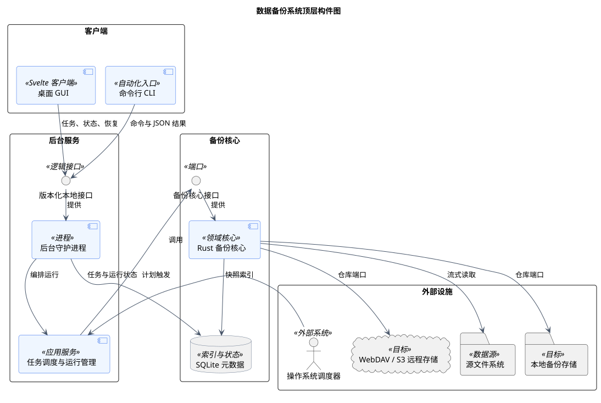
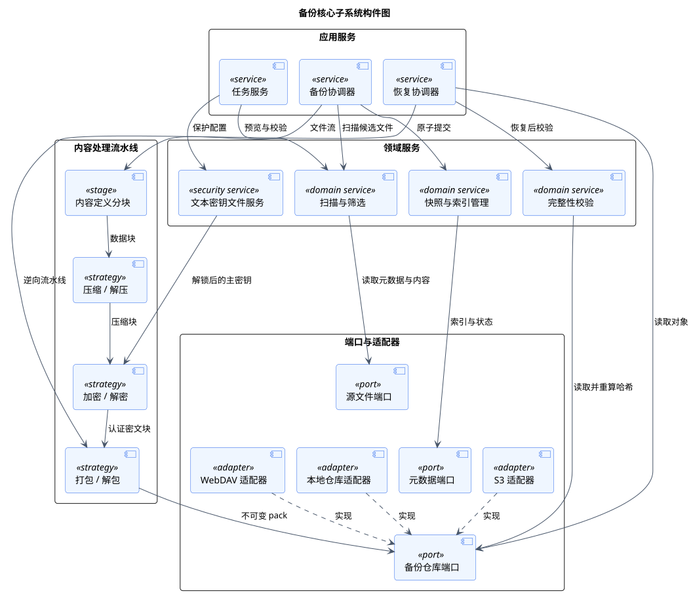
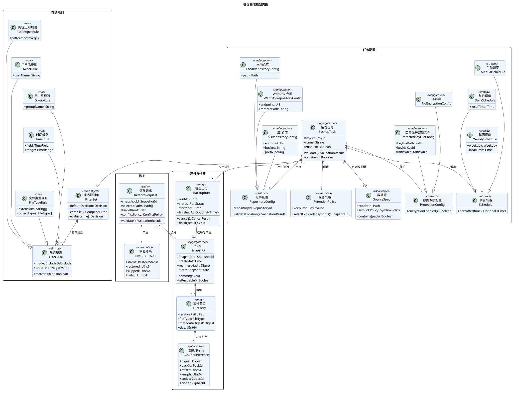
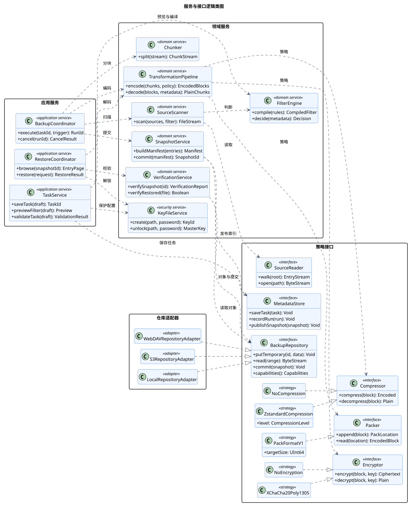
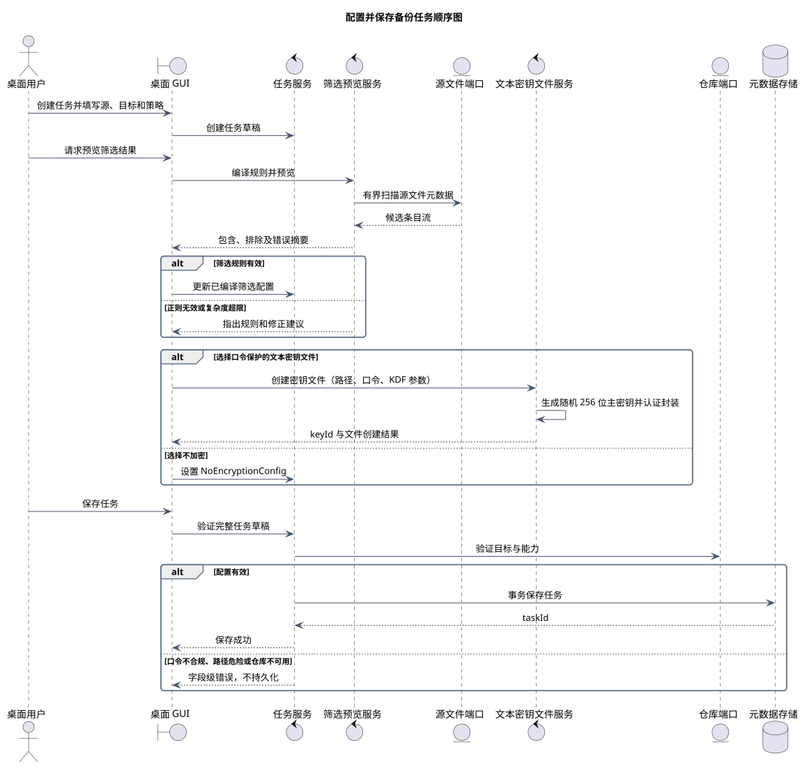
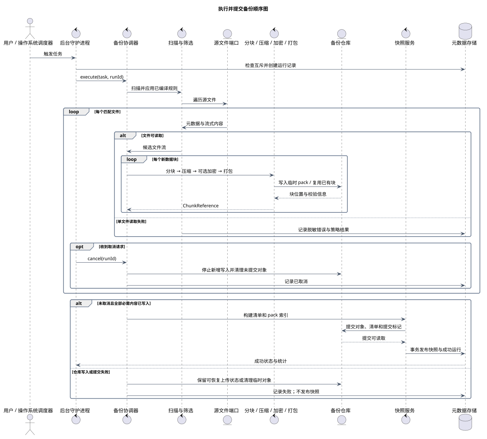
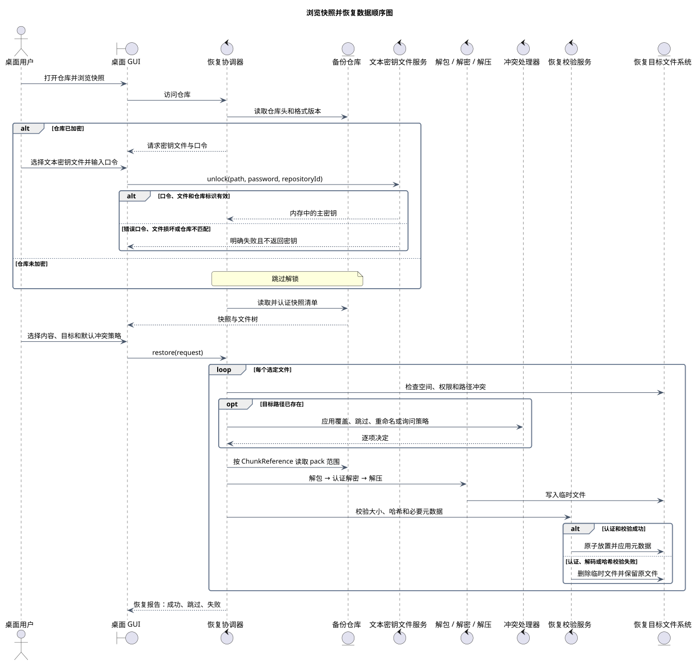

# 数据备份系统逻辑设计

> 版本 1.0；更新日期 2026-09-11。

本文档描述实现前的逻辑设计边界。图中的类、接口和构件用于约束职责与协作，不代表已经存在的 Rust 类型、进程协议或第三方库绑定。

## 构件设计

### 数据备份系统顶层构件图

图 1 数据备份系统顶层构件图

该图从进程和外部系统边界说明桌面端、命令行、后台服务、备份核心及存储设施的协作方式。GUI 与 CLI 均通过同一版本化本地接口访问后台服务，核心逻辑不依赖具体交互端。

| 元素 | 职责 |
|---|---|
| 桌面 GUI / CLI | 提供交互和自动化入口，不直接修改仓库或 SQLite。 |
| 版本化本地接口 | 统一客户端协议、事件流、错误语义和兼容性协商。 |
| 后台守护进程 | 管理任务生命周期、计划触发、互斥、进度和通知。 |
| Rust 备份核心 | 实现扫描、变换、快照、校验、恢复和保留清理。 |
| SQLite 元数据 | 保存任务、运行、快照索引和校验结果，不保存用户文件内容。 |
| 源与目标存储 | 通过端口提供源文件读取及本地、WebDAV、S3 仓库访问。 |

关系与交互说明：

- GUI 和 CLI 依赖同一本地接口，因此后台运行不会因 GUI 退出而中止。
- 操作系统调度器只触发计划，具体互斥、重试和状态转换由后台服务负责。
- 备份核心经统一仓库端口访问本地或远程目标，远程协议细节不得进入领域逻辑。
- SQLite 保存可重建的控制面元数据，备份内容和清单位于备份仓库。

关键约束：

- 客户端、API、数据库和仓库格式必须显式版本化。
- 同一任务不能并发执行两个修改仓库的操作。
- 日志、状态事件和诊断包不得包含口令、主密钥或用户文件内容。

追踪关系：用例：UC-01、UC-02、UC-03、UC-04、UC-05、UC-06、UC-07、UC-08、UC-16；功能需求：FR-01、FR-02、FR-03、FR-04、FR-05、FR-06、FR-07、FR-08、FR-09、FR-10、FR-11、FR-12、FR-13、FR-16；非功能需求：NFR-01、NFR-03、NFR-04、NFR-05、NFR-06、NFR-07、NFR-08、NFR-09、NFR-10。

### 备份核心子系统构件图

图 2 备份核心子系统构件图

该图细化备份核心内部的应用服务、内容处理流水线和端口适配器。所有可替换算法与外部存储均位于稳定接口之后，以便独立测试和逐步接入远程目标。

| 元素 | 职责 |
|---|---|
| 任务服务 | 管理任务配置、筛选预览、保护配置和保存前校验。 |
| 备份 / 恢复协调器 | 编排长时间运行流程、取消点、失败隔离和状态报告。 |
| 扫描与筛选 | 对预览和正式备份执行同一套有序规则。 |
| 内容处理流水线 | 写入按分块、压缩、加密、打包执行，读取严格逆序。 |
| 文本密钥文件服务 | 创建和读取版本化 JSON 密钥文件，仅向加密策略提供内存中的主密钥。 |
| 仓库端口与适配器 | 统一对象读写、列举、临时上传、原子提交及能力探测。 |

关系与交互说明：

- 任务服务在保存任务前编译筛选规则并验证源、目标、调度和算法组合。
- 备份写入顺序固定为分块、压缩、可选认证加密、打包；恢复按相反顺序读取。
- 快照服务只在全部 pack 和清单可读取后发布提交标记，再写入成功状态。
- 本地、WebDAV 和 S3 适配器实现同一仓库端口，核心只依赖端口能力。

关键约束：

- 每个块必须记录格式、压缩算法、加密算法和版本。
- 未知的必需算法必须拒绝读取，不得猜测或静默降级。
- 错误口令、损坏密钥文件或认证失败不得输出最终明文。

追踪关系：用例：UC-01、UC-02、UC-04、UC-05、UC-06、UC-07、UC-09、UC-10、UC-11、UC-12、UC-13、UC-14、UC-14L、UC-14R、UC-15、UC-16、UC-17、UC-18；功能需求：FR-01、FR-02、FR-04、FR-05、FR-06、FR-07、FR-08、FR-10、FR-13、FR-14、FR-15、FR-16；非功能需求：NFR-01、NFR-02、NFR-03、NFR-04、NFR-07、NFR-10、NFR-11、NFR-12、NFR-13。

## 静态类模型

### 备份领域模型类图

图 3 备份领域模型类图

该图描述任务配置、运行、快照内容和恢复请求之间的稳定业务关系。组合关系用于表达生命周期所有权，泛化关系用于表达可替换的调度、筛选、保护和仓库配置。

| 元素 | 职责 |
|---|---|
| BackupTask | 任务配置聚合根，维护源、筛选、调度、保留、保护和仓库配置的一致性。 |
| FilterSet / FilterRule | 保存有序包含/排除规则，并支持路径、用户、组、时间和文件类型特化。 |
| BackupRun | 记录一次执行的状态、统计、取消和失败信息。 |
| Snapshot / FileEntry / ChunkReference | 表示不可变快照、目录清单和内容寻址块引用。 |
| RepositoryConfig | 抽象本地、WebDAV 和 S3 的连接及目标位置配置。 |
| RestoreRequest / RestoreResult | 描述恢复选择、目标、冲突策略及最终逐项统计。 |

关系与交互说明：

- BackupTask 对任务配置对象使用组合关系，删除任务配置不会默认删除独立存在的已提交快照。
- BackupRun 只有在原子提交成功后才关联一个 Snapshot，取消或失败运行不产生成功快照。
- Snapshot 组合文件条目，文件条目组合按顺序排列的数据块引用；实际块可被多个快照复用。
- 筛选、调度、保护和仓库配置使用泛化表达合法变体，不把算法内部步骤建模为领域实体。

关键约束：

- 快照一经提交即不可变，清单只引用已经完整写入的块和 pack。
- FilterSet 必须在保存任务时完成规则编译与复杂度校验。
- ProtectedKeyFileConfig 只保存密钥文件位置、密钥标识和 KDF 配置，不保存口令或主密钥。

追踪关系：用例：UC-01、UC-02、UC-03、UC-05、UC-06、UC-07、UC-09、UC-10、UC-11、UC-12、UC-13、UC-14、UC-14L、UC-14R、UC-15、UC-16、UC-17、UC-18；功能需求：FR-01、FR-02、FR-03、FR-04、FR-05、FR-06、FR-08、FR-09、FR-10、FR-13、FR-14、FR-15、FR-16；非功能需求：NFR-01、NFR-02、NFR-05、NFR-10、NFR-11、NFR-12、NFR-13。

### 服务与接口逻辑类图

图 4 服务与接口逻辑类图

该图描述应用服务、领域服务、算法策略及存储端口之间的依赖倒置关系。接口只表达稳定能力，不绑定同步或异步调用形式，也不等同于最终 Rust trait 的完整签名。

| 元素 | 职责 |
|---|---|
| TaskService | 协调任务草稿校验、筛选预览、密钥文件创建和配置持久化。 |
| BackupCoordinator | 执行备份状态机并在安全点响应取消。 |
| RestoreCoordinator | 浏览快照、处理冲突、解码、校验并原子放置恢复文件。 |
| TransformationPipeline | 按记录在块元数据中的策略完成编码和逆向解码。 |
| BackupRepository | 定义本地与远程仓库共同需要的临时写入、读取、提交和能力接口。 |
| 算法策略 | 压缩、加密与打包实现可替换，读取端按格式标识选择实现。 |

关系与交互说明：

- 应用服务仅依赖领域服务和接口，适配器通过实现接口接入，形成端口与适配器结构。
- TransformationPipeline 聚合 Compressor、Encryptor 和 Packer 策略，但不决定用户界面中的预设名称。
- NoCompression 与 Zstandard、NoEncryption 与 XChaCha20-Poly1305 是当前已确认的逻辑实现变体。
- Repository 的能力探测用于处理本地原子重命名与远程临时对象提交之间的差异。

关键约束：

- 接口签名是逻辑契约，不预先决定 Rust trait 的异步、生命周期或错误类型。
- 恢复时必须由块元数据选择解压和解密实现，不能依赖当前任务默认值。
- 远程适配器必须实现超时、有界重试和未提交对象清理。

追踪关系：用例：UC-01、UC-02、UC-04、UC-05、UC-06、UC-07、UC-09、UC-10、UC-11、UC-12、UC-13、UC-14、UC-14L、UC-14R、UC-15、UC-16、UC-17、UC-18；功能需求：FR-01、FR-02、FR-04、FR-05、FR-06、FR-07、FR-08、FR-10、FR-13、FR-14、FR-15、FR-16；非功能需求：NFR-01、NFR-02、NFR-04、NFR-07、NFR-10、NFR-11、NFR-12、NFR-13。

## 动态交互模型

### 配置并保存备份任务顺序图

图 5 配置并保存备份任务顺序图

该图描述桌面用户建立任务草稿、预览筛选、配置数据保护、校验并保存任务的完整交互。保存操作仅在所有配置通过校验后发生。

| 元素 | 职责 |
|---|---|
| 桌面 GUI | 维护任务草稿、收集口令并展示预览和字段级错误。 |
| 任务服务 | 执行跨字段校验并只持久化完整有效配置。 |
| 筛选预览服务 | 使用与正式备份相同的规则编译和匹配逻辑。 |
| 文本密钥文件服务 | 生成主密钥并写入口令保护的版本化 JSON 文件。 |
| 仓库与元数据端口 | 验证目标能力并事务保存任务。 |

关系与交互说明：

- 用户可多次预览并修正规则，预览失败不会修改已保存任务。
- 加密分支只把口令传给密钥文件服务；返回给任务配置的是文件位置和 keyId。
- 最终保存前统一验证源目标嵌套、写权限、调度、筛选、算法组合和仓库能力。

关键约束：

- 口令不得写入任务配置、日志或密钥文件。
- 正则规则必须限制复杂度，避免灾难性回溯。
- 验证失败时不得产生部分持久化任务。

追踪关系：用例：UC-01、UC-09、UC-10、UC-11；功能需求：FR-01、FR-02、FR-03、FR-10、FR-14、FR-15、FR-16；非功能需求：NFR-03、NFR-05、NFR-07、NFR-11、NFR-12、NFR-13。

### 执行并提交备份顺序图

图 6 执行并提交备份顺序图

该图描述手动或计划触发后，从创建运行记录到原子发布快照的主要过程。对每个文件和数据块采用流式处理，并在明确的安全点响应取消。

| 元素 | 职责 |
|---|---|
| 后台守护进程 | 接收触发、保证任务互斥、转发取消并发布运行状态。 |
| 扫描与筛选 | 遍历源、执行规则并按策略隔离单文件错误。 |
| 内容处理流水线 | 以有界内存处理文件流，生成可复用的数据块和 pack。 |
| 备份仓库 | 接收临时对象、复用已有块并原子发布提交标记。 |
| 快照与元数据服务 | 在仓库提交可读取后事务发布成功快照及运行统计。 |

关系与交互说明：

- 手动触发和计划触发进入同一执行路径，避免形成两套备份实现。
- 文件和块使用嵌套循环表达流式处理，内存占用不随总备份量线性增长。
- 取消只在安全点生效；已经提交的旧快照不受影响。
- 远程失败可保留可恢复上传状态，但没有提交标记的内容不得成为成功快照。

关键约束：

- 同一任务的仓库修改操作必须互斥。
- 元数据成功状态必须晚于仓库提交可读确认。
- 运行失败或取消不得产生可浏览、可恢复的成功快照。

追踪关系：用例：UC-02、UC-03、UC-12、UC-13、UC-16；功能需求：FR-03、FR-04、FR-05、FR-06、FR-09、FR-11、FR-13、FR-14、FR-15、FR-16；非功能需求：NFR-01、NFR-02、NFR-04、NFR-08、NFR-10、NFR-11、NFR-12、NFR-13。

### 浏览快照并恢复数据顺序图

图 7 浏览快照并恢复数据顺序图

该图描述用户访问仓库、浏览快照并恢复所选内容的完整过程。加密仓库在读取受保护元数据前解锁，恢复内容先写入临时位置，认证和哈希校验成功后才原子放置。

| 元素 | 职责 |
|---|---|
| 恢复协调器 | 统一仓库访问、解锁、清单浏览、冲突处理和逐项恢复。 |
| 文本密钥文件服务 | 验证版本、KDF、认证标签和仓库标识，成功后返回内存主密钥。 |
| 解码流水线 | 根据块元数据执行解包、认证解密和解压。 |
| 冲突处理器 | 应用默认策略或请求用户逐项决策。 |
| 恢复校验服务 | 校验临时文件，成功后原子放置，失败时清理临时内容。 |

关系与交互说明：

- 仓库头只暴露格式识别和解锁所需信息，加密清单必须在解锁后读取。
- 错误口令、损坏密钥文件和仓库标识不匹配在解码用户数据前终止。
- 冲突策略可为覆盖、跳过、重命名或询问，任何策略都不能在校验前破坏原文件。
- 每个文件独立报告结果，某一文件失败时可按策略继续其他独立文件。

关键约束：

- 未经认证和哈希校验的内容不得成为最终恢复文件。
- 未知格式或算法版本必须明确失败。
- 主密钥只在恢复运行所需的内存范围内存在，不写入日志、状态或诊断包。

追踪关系：用例：UC-04、UC-05、UC-06、UC-14、UC-14L、UC-14R、UC-15、UC-17、UC-18；功能需求：FR-07、FR-08、FR-13、FR-14、FR-15；非功能需求：NFR-01、NFR-02、NFR-03、NFR-05、NFR-06、NFR-10、NFR-11、NFR-12。

## 建模边界

- 当前模型保持逻辑层级，不决定桌面外壳、本地 IPC 形式和具体 Rust 类型布局。
- 压缩、加密、打包和仓库访问均通过策略或端口替换，读取端依据版本化元数据自动识别。
- 文本密钥文件只保存认证加密后的主密钥及 KDF 参数，不保存口令或明文主密钥。

PlantUML 固定版本：1.2026.8；SHA-256：`5e1ecfa8ecd32c90b03bbf3b1eb6f020943f98ab0fcf4032be31a0002ee2c462`。
