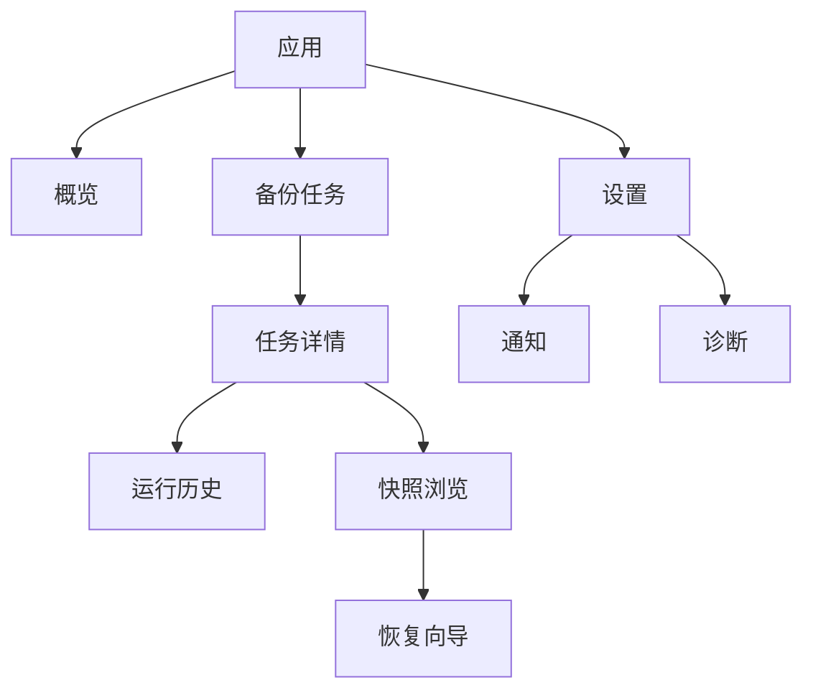

# 界面低保真原型

## 设计原则

- 首屏回答三个问题：是否受保护、最近一次结果、下一步要做什么。
- 任务创建采用分步流程，路径和权限错误在离开当前步骤前反馈。
- “删除快照”“覆盖恢复”等高风险行为使用动作、对象和影响明确的确认文案。
- 所有状态同时使用图标、文字和颜色，不能只靠颜色区分。

## 信息架构



## 概览页

```text
┌──────────────────────────────────────────────────────────────────┐
│ Data Backup                                      服务：● 正常   │
├─────────────┬────────────────────────────────────────────────────┤
│ ▣ 概览      │ 备份状态                              [+ 新建任务] │
│ □ 备份任务  │                                                    │
│ □ 设置      │ ┌────────────────┐ ┌────────────────┐             │
│             │ │ 文档备份       │ │ 照片备份       │             │
│             │ │ ✓ 2 小时前成功 │ │ ! 目标磁盘离线 │             │
│             │ │ 下次：今晚 22:00│ │ [查看并修复]   │             │
│             │ │ [立即备份]     │ │                │             │
│             │ └────────────────┘ └────────────────┘             │
│             │                                                    │
│             │ 最近活动                                           │
│             │ 14:20 文档备份  成功  24 个文件 / 128 MB           │
└─────────────┴────────────────────────────────────────────────────┘
```

空状态应显示一段简短解释和唯一主操作“创建第一个备份任务”。守护进程离线时，顶栏显示明确错误并提供重试和诊断入口。

## 新建任务向导

```text
┌──────────────────────────────────────────────────────────────────┐
│ 新建备份任务                                                     │
│ ① 备份内容 ── ② 保存位置 ── ③ 计划与保留 ── ④ 确认             │
├──────────────────────────────────────────────────────────────────┤
│ 任务名称  [ 工作文档                                      ]      │
│                                                                  │
│ 备份源                                                           │
│ ┌──────────────────────────────────────────────────────────────┐ │
│ │ ~/Documents                                           [移除] │ │
│ └──────────────────────────────────────────────────────────────┘ │
│ [+ 添加文件或目录]                                               │
│                                                                  │
│ 筛选规则  [排除 **/*.tmp                         ] [高级] [+] │
│                                                                  │
│                                          [取消] [下一步：目标 →] │
└──────────────────────────────────────────────────────────────────┘
```

最后一步展示源、目标、计划、筛选、数据保护和保留规则的可读摘要，并提供“保存并首次备份”与“仅保存”两个动作。

## 筛选规则编辑器

```text
┌──────────────────────────────────────────────────────────────────┐
│ 文件筛选                                      [预览匹配结果]      │
├──────────────────────────────────────────────────────────────────┤
│ 默认：包含                                                       │
│ 1  排除  路径 glob    **/.git/**                     [编辑] [删] │
│ 2  排除  扩展名       tmp, cache                     [编辑] [删] │
│ 3  包含  修改时间     最近 30 天                     [编辑] [删] │
│ 4  排除  所有者       root (UID 0)                   [编辑] [删] │
│ [+ 添加规则]                                                     │
├──────────────────────────────────────────────────────────────────┤
│ 预览：包含 12,408 项 / 2.3 GB；排除 1,021 项 / 480 MB            │
│ reports/a.tmp  → 排除（规则 2：扩展名 tmp）                      │
└──────────────────────────────────────────────────────────────────┘
```

高级正则需要明确标记；用户名和用户组同时显示名称及 UID/GID；相对时间预览显示本次换算出的具体截止时间。

## 数据保护设置

```text
┌──────────────────────────────────────────────────────────────────┐
│ 数据保护                                                        │
├──────────────────────────────────────────────────────────────────┤
│ 加密方式     [文本密钥文件 ▾]  （不加密 / 文本密钥文件）        │
│   口令       [••••••••••••••••]                                 │
│   确认口令   [••••••••••••••••]                                 │
│   密钥文件   [选择保存位置…]                                     │
│   ! 恢复时必须同时提供该密钥文件和正确口令。                     │
│                                                                  │
│ 压缩         [自动（Zstandard） ▾]                               │
│              关闭 / 快速 / 平衡 / 高压缩                         │
│ 打包         [自动 ▾]  （本地优化 / 远程存储优化）               │
└──────────────────────────────────────────────────────────────────┘
```

算法名称和底层参数默认折叠在“高级信息”中，避免普通用户必须理解密码学细节。恢复时软件根据块头自动选择解密和解压算法，不要求用户选择；恢复向导在认证成功前不显示未验证数据为成功。tar/zip 只出现在“导出”功能中，不作为仓库打包选项。

## 任务详情与运行状态

```text
┌──────────────────────────────────────────────────────────────────┐
│ ← 工作文档                 已启用     [立即备份] [⋯]             │
├──────────────────────────────────────────────────────────────────┤
│ 正在备份：复制文件                                               │
│ ████████████████░░░░░░  68%     1.8 / 2.6 GB       [取消]       │
│ 12,430 / 18,102 个文件 · 已用 03:18 · 当前：reports/2026.pdf    │
├──────────────────────────────────────────────────────────────────┤
│ [概况] [运行历史] [快照] [配置]                                 │
│                                                                  │
│ 最近运行                                                         │
│ ✓ 2026-09-04 14:20  成功  +128 MB  03:41          [查看详情]    │
│ ✕ 2026-09-03 22:00  失败  目标不可用              [查看并修复]  │
└──────────────────────────────────────────────────────────────────┘
```

进度未知时展示活动阶段和累计统计，不展示虚假的百分比。

## 快照浏览与恢复

```text
┌──────────────────────────────────────────────────────────────────┐
│ 工作文档 / 快照                    时间点 [2026-09-04 14:20 ▾]   │
├──────────────────┬───────────────────────────────────────────────┤
│ 搜索 [          ]│ 名称              大小       修改时间          │
│                  │ □ Projects/        —          2026-09-04      │
│ ▾ Documents      │ □ notes.md         18 KB      2026-09-03      │
│   ▸ Projects     │ □ budget.xlsx      2.4 MB     2026-09-01      │
│   □ notes.md     │                                               │
│                  │                  已选择 0 项   [恢复所选项目]   │
└──────────────────┴───────────────────────────────────────────────┘
```

恢复确认页必须显示快照时间、项目数、总大小、恢复位置和冲突策略。完成页提供成功/失败计数和可导出的报告。

## 响应与可访问性要求

- 主要桌面窗口最小宽度暂定 900 px；较窄窗口折叠侧栏，不隐藏核心动作。
- 所有表单元素有持久标签和内联错误；错误出现后焦点移至错误摘要。
- 长任务可离开当前页面，并通过全局状态与系统通知继续反馈。
- 支持键盘完成建任务、启动、浏览快照和恢复流程。
