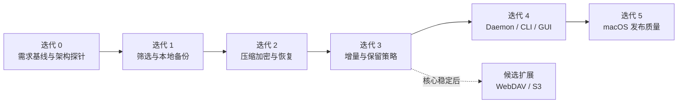

# 单人敏捷开发计划

项目采用单人、小批量、持续交付方式推进，不设置固定日历期限。每个迭代只选取能够形成可验证增量的工作；完成当前迭代的验收条件后，再拉取下一项。

## 工作方式

- 使用一周左右的短迭代，但以目标完成而不是日期作为结束条件。
- 同一时间只保留一个主要开发目标，限制在制品数量。
- 每个功能均经历：验收标准 → 设计决策 → 实现 → 自动化测试 → 文档同步。
- 每次迭代末演示可运行增量，回顾风险并重新排列 backlog。
- 恢复正确性、数据格式兼容和删除安全的优先级高于功能数量。

## 交付路线

这是依赖关系图，不代表固定工期。若用户反馈改变优先级，可拆分或重排尚未开始的迭代，但不能绕过数据安全验收。

## 迭代 backlog

| 顺序 | 目标 | 可交付增量 | 完成定义 |
| --- | --- | --- | --- |
| 0 | 降低架构风险 | ADR、仓库格式、块级压缩/加密后聚合 pack 的探针、故障实验 | 随机块恢复、元数据保密、认证失败、原子提交和崩溃清理得到验证 |
| 1 | 第一次可靠备份 | Rust 核心扫描、筛选预览、对象写入、快照清单和基础 CLI | 可解释筛选结果；重复执行不重复存储内容 |
| 2 | 真正可恢复 | Zstandard、认证加密/解密、完整性校验、快照浏览、恢复命令 | 完成“加密备份—破坏源—恢复—哈希核对”；错误口令不输出文件 |
| 3 | 可长期使用 | 增量检测、排除规则、保留与垃圾回收 | 清理后所有保留快照仍可校验和恢复 |
| 4 | 桌面产品闭环 | 守护进程、调度、本地 API、Svelte GUI、通知 | GUI 关闭时计划仍执行；核心用例可从 GUI 完成 |
| 5 | macOS 可发布 | 自启动、安装包、升级、诊断、性能和故障注入 | macOS 发布验收清单全部通过 |
| 候选 | 远程目标 | WebDAV 或 S3 适配器，另一个随后实现 | 网络中断可恢复，未完成上传不产生有效快照 |

远程目标开始前先用短期技术探针比较 WebDAV 和 S3。优先实现验证环境稳定、用户价值更高的一种，而不是同时铺开两套实现。

## 单人职责

开发者同时承担产品、UX、Rust 核心、前端和质量职责。为减少单点判断风险：

- 高风险数据操作先写 ADR 和测试，再实现生产路径。
- 快照格式一旦进入可用版本，变更必须带迁移或兼容读取方案。
- 删除、垃圾回收和覆盖恢复代码在发布前安排独立评审。
- 每个迭代同步更新 `README.md`、需求文档和实验报告。

## 测试策略

- 单元测试：路径规则、清单、保留计算、状态机。
- 属性测试：任意文件树的快照引用与清理不变量。
- 集成测试：临时文件系统中的备份、增量、校验和恢复。
- 故障注入：读取失败、空间不足、目标断开、进程中断、数据库锁定和网络超时。
- 端到端测试：GUI/CLI—守护进程—仓库完整链路。
- 发布测试：macOS 安装、升级、自启动、通知、卸载及独立恢复演练。

## 当前迭代：迭代 0

### 待办

1. 评审本地备份 MVP 的 Must 需求。
2. 确认符号链接、权限和 macOS 扩展属性的恢复预期。
3. 建立 ADR-0002 至 ADR-0005 的技术探针。
4. 验证 ADR-0008 的分块、块级 Zstandard、块级 XChaCha20-Poly1305、密文 pack、元数据加密和 Argon2id 管线。
5. 验证 ADR-0009 的 glob/正则、UID/GID、时间和对象类型规则。
6. 选取大量小文件和大文件两类基准数据集。
7. 设计最小仓库格式并验证中断安全。

### 完成定义

- 关键技术选择有 ADR 和可复现证据。
- 仓库格式探针能写入、提交、发现并清理未完成快照。
- 下一迭代的验收测试先于正式实现落地。
