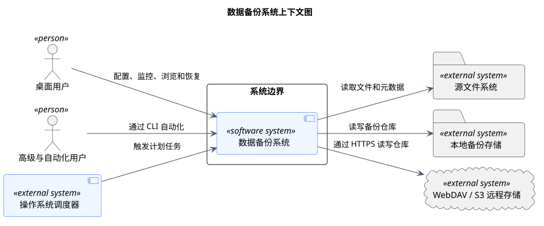

# C1 系统上下文

> 版本 1.1；更新日期 2026-09-18。

本文档由 `model.yaml` 生成，仅用于课程报告；项目架构见[架构入口](../architecture/README.md)。

## 数据备份系统上下文图

图 1 数据备份系统上下文图

该图界定数据备份系统与使用者及外部系统的边界。桌面用户负责配置、查看和恢复，自动化用户与操作系统调度器可触发任务，系统从源文件系统读取数据并写入本地或远程备份存储。

| 元素 | 职责 |
|---|---|
| 数据备份系统 | 配置并执行备份、维护快照、校验仓库以及安全恢复数据。 |
| 桌面用户 | 完成交互式任务配置、状态查看、快照浏览和恢复。 |
| 高级与自动化用户 | 通过 CLI 调用与桌面端一致的能力。 |
| 外部系统 | 提供计划触发、源数据及本地或远程持久化能力。 |

关系与交互说明：

- 系统拥有备份流程和元数据，源文件系统与备份存储位于信任边界之外。
- 本地存储与 WebDAV/S3 均是备份仓库目标，但远程目标还需处理网络故障和能力差异。
- 自动化用户是桌面用户能力的命令行表达，不获得绕过校验或安全约束的特权。

关键约束：

- 所有外部错误必须保留明确语义并呈现给调用者。
- 用户口令、明文主密钥和用户文件内容不得进入日志或诊断信息。
- 失败或取消的运行不得暴露为可恢复快照。

追踪关系：用例：UC-01、UC-02、UC-03、UC-04、UC-05、UC-06、UC-07、UC-08、UC-16；功能需求：FR-01、FR-02、FR-03、FR-04、FR-05、FR-06、FR-07、FR-08、FR-09、FR-10、FR-11、FR-12、FR-13、FR-14、FR-15、FR-16；非功能需求：NFR-01、NFR-02、NFR-03、NFR-04、NFR-05、NFR-06、NFR-07、NFR-08、NFR-09、NFR-10、NFR-11、NFR-12、NFR-13。

PlantUML 固定版本：1.2026.8；SHA-256：`5e1ecfa8ecd32c90b03bbf3b1eb6f020943f98ab0fcf4032be31a0002ee2c462`。
