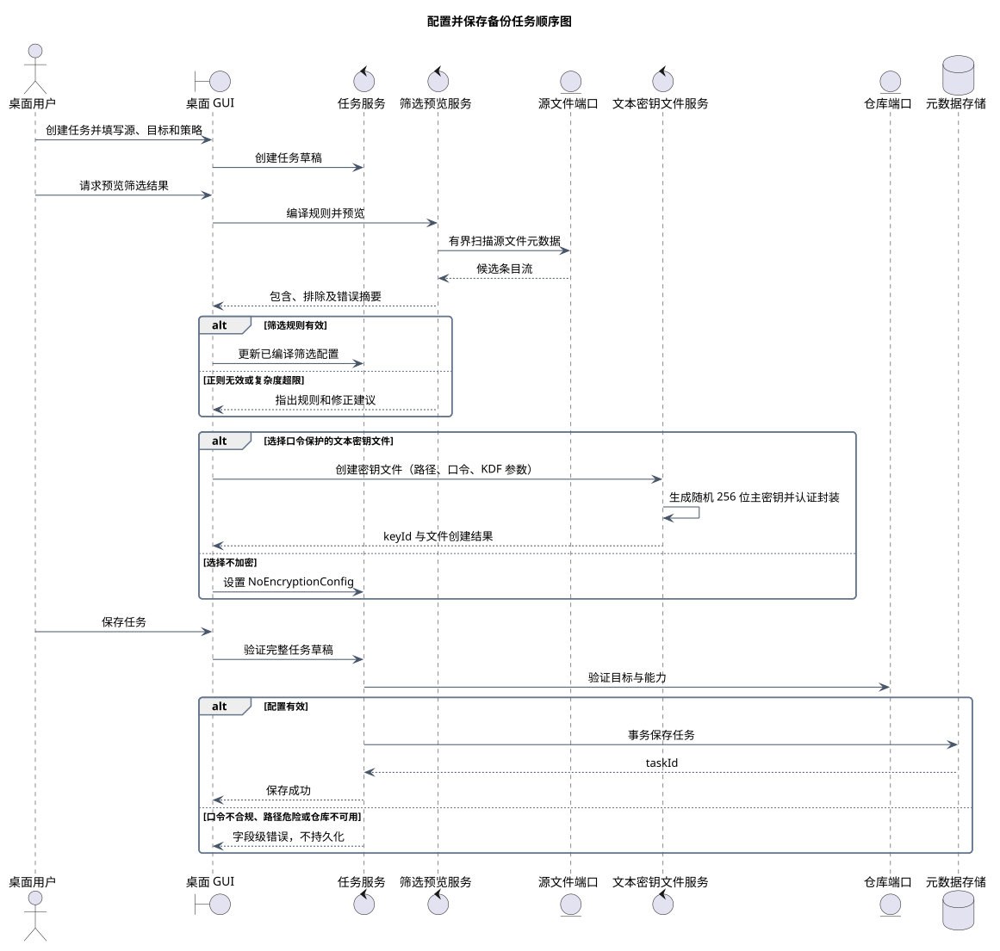
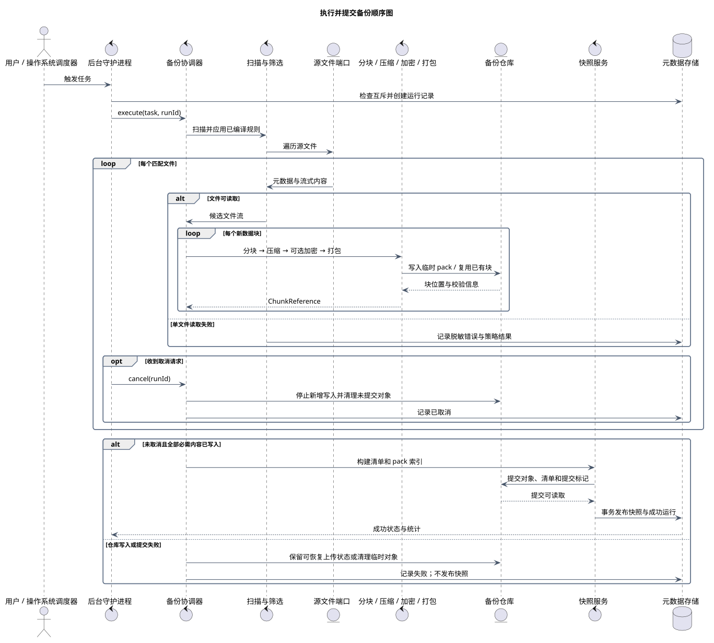
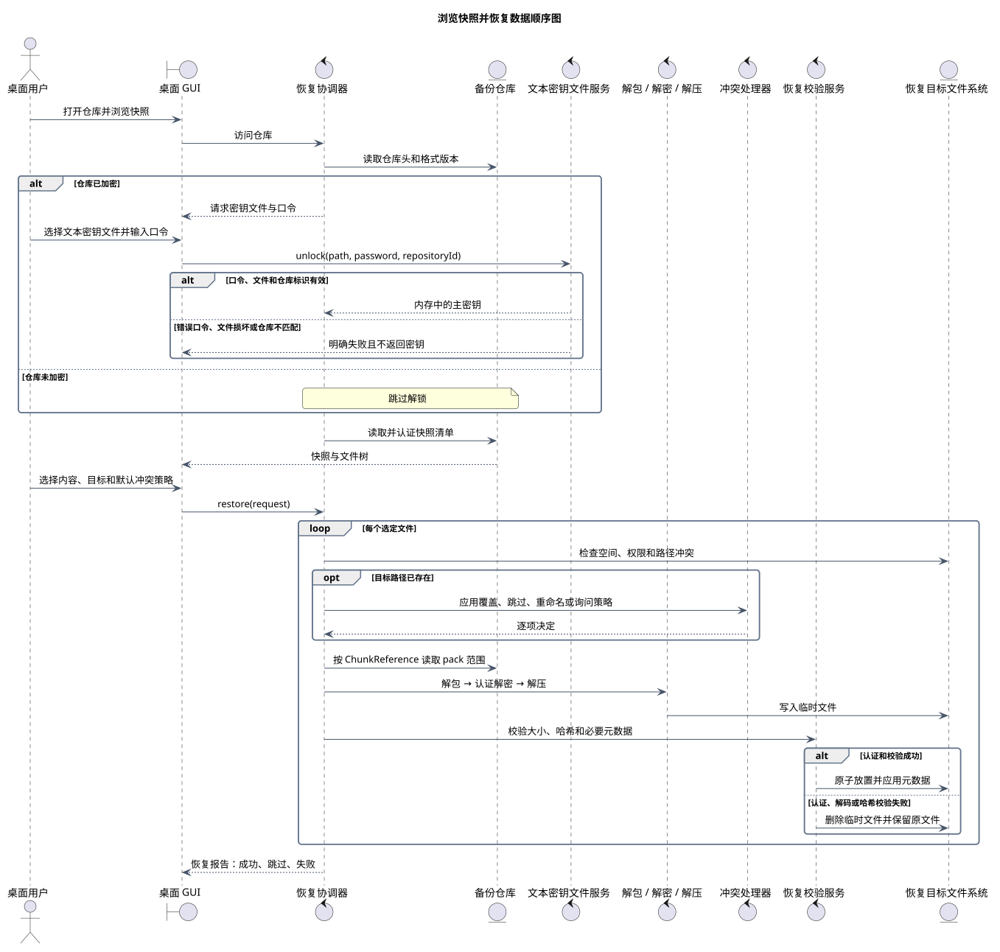

# 动态交互视图

> 版本 1.1；更新日期 2026-09-18。

本文档由 `model.yaml` 生成，仅用于课程报告；项目架构见[架构入口](../architecture/README.md)。

## 配置并保存备份任务顺序图

图 1 配置并保存备份任务顺序图

该图描述桌面用户建立任务草稿、预览筛选、配置数据保护、校验并保存任务的完整交互。保存操作仅在所有配置通过校验后发生。

| 元素 | 职责 |
|---|---|
| 桌面 GUI | 维护任务草稿、收集口令并展示预览和字段级错误。 |
| 任务服务 | 执行跨字段校验并只持久化完整有效配置。 |
| 筛选预览服务 | 使用与正式备份相同的规则编译和匹配逻辑。 |
| 文本密钥文件服务 | 生成主密钥并写入口令保护的版本化 JSON 文件。 |
| 仓库与元数据端口 | 验证目标能力并事务保存任务。 |

关系与交互说明：

- 用户可多次预览并修正规则，预览失败不会修改已保存任务。
- 加密分支只把口令传给密钥文件服务；返回给任务配置的是文件位置和 keyId。
- 最终保存前统一验证源目标嵌套、写权限、调度、筛选、算法组合和仓库能力。

关键约束：

- 口令不得写入任务配置、日志或密钥文件。
- 正则规则必须限制复杂度，避免灾难性回溯。
- 验证失败时不得产生部分持久化任务。

追踪关系：用例：UC-01、UC-09、UC-10、UC-11；功能需求：FR-01、FR-02、FR-03、FR-10、FR-14、FR-15、FR-16；非功能需求：NFR-03、NFR-05、NFR-07、NFR-11、NFR-12、NFR-13。

## 执行并提交备份顺序图

图 2 执行并提交备份顺序图

该图描述手动或计划触发后，从创建运行记录到原子发布快照的主要过程。对每个文件和数据块采用流式处理，并在明确的安全点响应取消。

| 元素 | 职责 |
|---|---|
| 后台守护进程 | 接收触发、保证任务互斥、转发取消并发布运行状态。 |
| 扫描与筛选 | 遍历源、执行规则并按策略隔离单文件错误。 |
| 内容处理流水线 | 以有界内存处理文件流，生成可复用的数据块和 pack。 |
| 备份仓库 | 接收临时对象、复用已有块并原子发布提交标记。 |
| 快照与元数据服务 | 在仓库提交可读取后事务发布成功快照及运行统计。 |

关系与交互说明：

- 手动触发和计划触发进入同一执行路径，避免形成两套备份实现。
- 文件和块使用嵌套循环表达流式处理，内存占用不随总备份量线性增长。
- 取消只在安全点生效；已经提交的旧快照不受影响。
- 远程失败可保留可恢复上传状态，但没有提交标记的内容不得成为成功快照。

关键约束：

- 同一任务的仓库修改操作必须互斥。
- 元数据成功状态必须晚于仓库提交可读确认。
- 运行失败或取消不得产生可浏览、可恢复的成功快照。

追踪关系：用例：UC-02、UC-03、UC-12、UC-13、UC-16；功能需求：FR-03、FR-04、FR-05、FR-06、FR-09、FR-11、FR-13、FR-14、FR-15、FR-16；非功能需求：NFR-01、NFR-02、NFR-04、NFR-08、NFR-10、NFR-11、NFR-12、NFR-13。

## 浏览快照并恢复数据顺序图

图 3 浏览快照并恢复数据顺序图

该图描述用户访问仓库、浏览快照并恢复所选内容的完整过程。加密仓库在读取受保护元数据前解锁，恢复内容先写入临时位置，认证和哈希校验成功后才原子放置。

| 元素 | 职责 |
|---|---|
| 恢复协调器 | 统一仓库访问、解锁、清单浏览、冲突处理和逐项恢复。 |
| 文本密钥文件服务 | 验证版本、KDF、认证标签和仓库标识，成功后返回内存主密钥。 |
| 解码流水线 | 根据块元数据执行解包、认证解密和解压。 |
| 冲突处理器 | 应用默认策略或请求用户逐项决策。 |
| 恢复校验服务 | 校验临时文件，成功后原子放置，失败时清理临时内容。 |

关系与交互说明：

- 仓库头只暴露格式识别和解锁所需信息，加密清单必须在解锁后读取。
- 错误口令、损坏密钥文件和仓库标识不匹配在解码用户数据前终止。
- 冲突策略可为覆盖、跳过、重命名或询问，任何策略都不能在校验前破坏原文件。
- 每个文件独立报告结果，某一文件失败时可按策略继续其他独立文件。

关键约束：

- 未经认证和哈希校验的内容不得成为最终恢复文件。
- 未知格式或算法版本必须明确失败。
- 主密钥只在恢复运行所需的内存范围内存在，不写入日志、状态或诊断包。

追踪关系：用例：UC-04、UC-05、UC-06、UC-14、UC-14L、UC-14R、UC-15、UC-17、UC-18；功能需求：FR-07、FR-08、FR-13、FR-14、FR-15；非功能需求：NFR-01、NFR-02、NFR-03、NFR-05、NFR-06、NFR-10、NFR-11、NFR-12。

PlantUML 固定版本：1.2026.8；SHA-256：`5e1ecfa8ecd32c90b03bbf3b1eb6f020943f98ab0fcf4032be31a0002ee2c462`。
