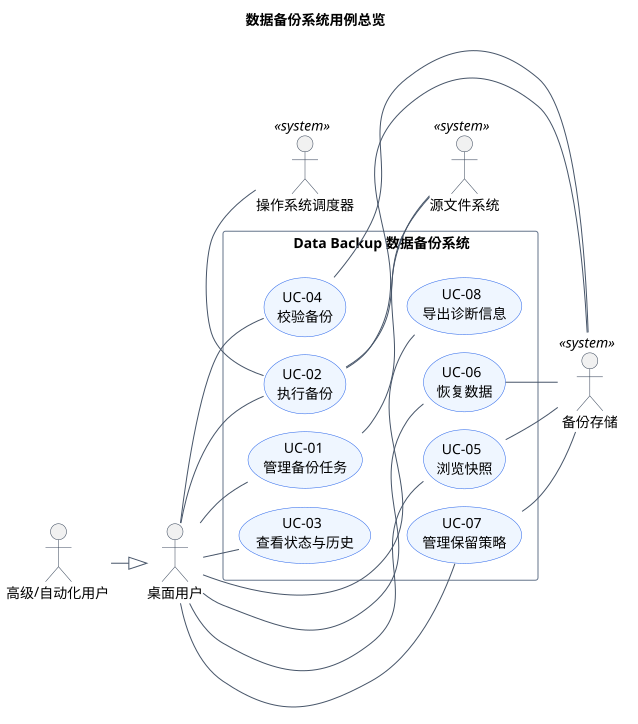
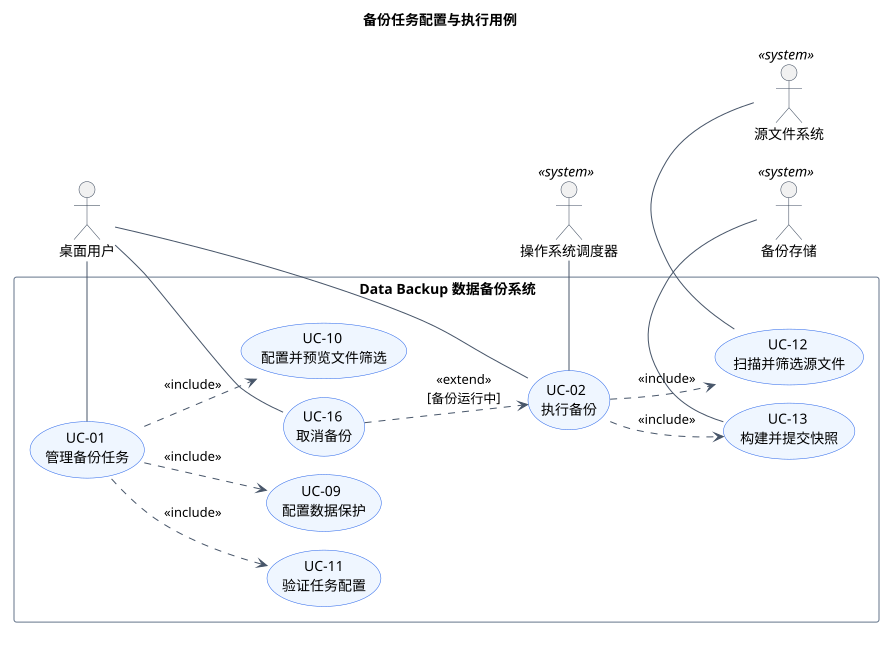
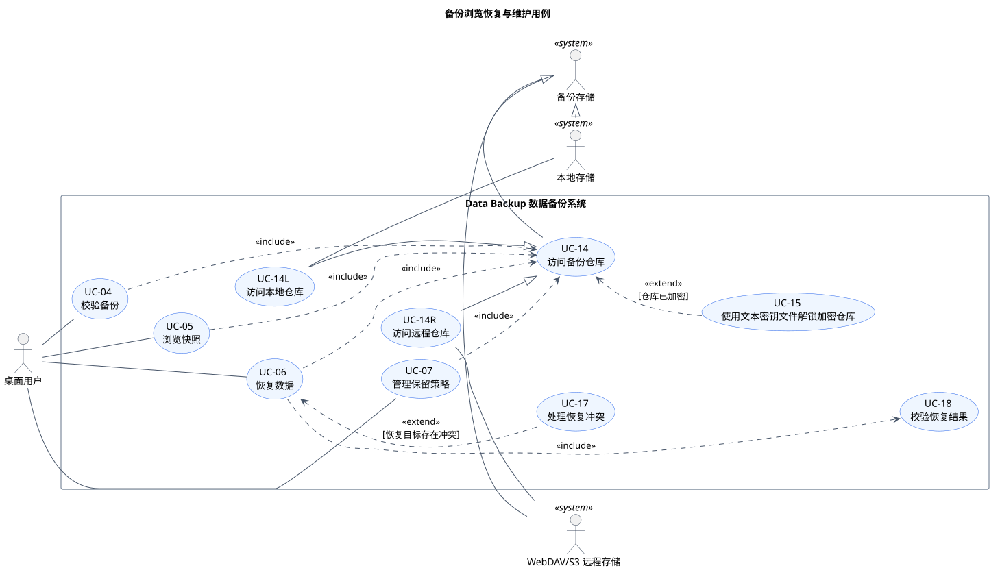

# 数据备份系统用例模型

> 版本 0.2；更新日期 2026-09-10；创建人：项目开发者。

本文档由 `use-cases.yaml` 自动生成。算法是用例步骤或配置项；只有参与者可感知、可复用或条件触发的行为才建模为独立用例。

## 建模约定

- `<<include>>` 表示基础用例无条件复用目标用例，箭头指向被包含用例。
- `<<extend>>` 表示满足条件时插入基础用例的扩展点，箭头指向基础用例。
- 空心三角箭头表示参与者或用例泛化；图中不使用普通依赖箭头。
- 总览图表达系统范围，专题图表达细化关系，避免把所有关系堆叠在一张图中。

## 用例图

### 系统总览

### 任务配置与执行

### 浏览、恢复与维护

## 参与者

| 标识 | 参与者 | 类型 | 泛化自 |
|---|---|---|---|
| USR | 桌面用户 | person | 无 |
| AUT | 高级/自动化用户 | person | 桌面用户 |
| OS | 操作系统调度器 | system | 无 |
| SRC | 源文件系统 | system | 无 |
| TGT | 备份存储 | system | 无 |
| LOCAL | 本地存储 | system | 备份存储 |
| REMOTE | WebDAV/S3 远程存储 | system | 备份存储 |

## 用例关系说明

| 关系 | 源用例 | 目标/基础用例 | 条件或含义 |
|---|---|---|---|
| include | UC-01 管理备份任务 | UC-09 配置数据保护 | 必须执行 |
| include | UC-01 管理备份任务 | UC-10 配置并预览文件筛选 | 必须执行 |
| include | UC-01 管理备份任务 | UC-11 验证任务配置 | 必须执行 |
| include | UC-02 执行备份 | UC-12 扫描并筛选源文件 | 必须执行 |
| include | UC-02 执行备份 | UC-13 构建并提交快照 | 必须执行 |
| include | UC-04 校验备份 | UC-14 访问备份仓库 | 必须执行 |
| include | UC-05 浏览快照 | UC-14 访问备份仓库 | 必须执行 |
| include | UC-06 恢复数据 | UC-14 访问备份仓库 | 必须执行 |
| include | UC-06 恢复数据 | UC-18 校验恢复结果 | 必须执行 |
| include | UC-07 管理保留策略 | UC-14 访问备份仓库 | 必须执行 |
| 泛化 | UC-14L 访问本地仓库 | UC-14 访问备份仓库 | 特化行为 |
| 泛化 | UC-14R 访问远程仓库 | UC-14 访问备份仓库 | 特化行为 |
| extend | UC-15 使用文本密钥文件解锁加密仓库 | UC-14 访问备份仓库 | 仓库已加密；扩展点：仓库已加密 |
| extend | UC-16 取消备份 | UC-02 执行备份 | 备份运行中；扩展点：备份运行中 |
| extend | UC-17 处理恢复冲突 | UC-06 恢复数据 | 恢复目标存在冲突；扩展点：恢复目标存在冲突 |

## 用例描述

### UC-01 管理备份任务

| 字段 | 内容 |
|---|---|
| 用例标识 | UC-01 |
| 用例名称 | 管理备份任务 |
| 创建人 | 项目开发者 |
| 创建日期 | 2026-09-10 |
| 语境目标 | 用户创建或修改可由系统执行的备份任务，并安全地启停或删除任务。 |
| 主参与者 | 桌面用户 |
| 辅助参与者 | SRC 源文件系统、TGT 备份存储 |
| 触发器 | 用户选择新建任务，或打开已有任务进行管理。 |
| 优先级 | Must |
| 前置条件 | 应用已安装且后台服务可用。；用户对所选源和目标具有必要访问权限。 |
| 成功结束状态 | 任务配置通过验证并持久化，守护进程加载最新版本。 |
| 失败结束状态 | 无效配置未被启用，原有任务和已有备份数据保持不变。 |
| 用例关系 | 包含：UC-09 配置数据保护、UC-10 配置并预览文件筛选、UC-11 验证任务配置；被包含于：无；扩展：无；泛化：无 |
| 扩展点 | 无 |
| 关联 FR | FR-01、FR-02、FR-03、FR-10、FR-14、FR-15、FR-16 |
| 关联 NFR | NFR-03、NFR-05、NFR-07 |
| 业务规则 | 删除任务与删除备份数据是两个独立动作。；危险路径嵌套必须阻止保存。 |
| 补充说明 | 新建和编辑共享同一配置流程；启停和删除作为任务管理的备选流程。 |

| 流程类型 | 步骤 | 执行者 | 动作/系统响应 |
|---|---|---|---|
| 基本流程 | B1 | 桌面用户 | 选择新建任务或打开已有任务。 |
| 基本流程 | B2 | 系统 | 显示名称、源、目标、计划、保留和当前配置。 |
| 基本流程 | B3 | 桌面用户 | 填写或修改基本配置。 |
| 基本流程 | B4 | 系统 | 执行 UC-09 和 UC-10，收集数据保护与筛选配置。 |
| 基本流程 | B5 | 桌面用户 | 确认配置摘要并保存。 |
| 基本流程 | B6 | 系统 | 执行 UC-11；验证成功后持久化配置并通知守护进程。 |
| 备选流程 | A1.1 | 系统/参与者 | 从 B1 分支；条件：用户选择启用或停用任务。系统更新启用状态和下一次运行时间，不修改快照数据。 |
| 备选流程 | A2.1 | 系统/参与者 | 从 B1 分支；条件：用户选择删除任务。系统分别确认任务配置和备份数据的处理方式。 |
| 备选流程 | A2.2 | 系统/参与者 | 用户确认后系统删除配置；备份数据默认保留。 |
| 异常流程 | E1.1 | 系统/参与者 | 从 B6 分支；条件：配置验证失败。系统定位错误字段并拒绝启用新配置。 |
| 异常流程 | E1.2 | 系统/参与者 | 用户修改后返回 B5。 |

### UC-02 执行备份

| 字段 | 内容 |
|---|---|
| 用例标识 | UC-02 |
| 用例名称 | 执行备份 |
| 创建人 | 项目开发者 |
| 创建日期 | 2026-09-10 |
| 语境目标 | 根据任务配置生成可验证、可恢复且原子提交的增量快照。 |
| 主参与者 | 桌面用户 |
| 辅助参与者 | OS 操作系统调度器、SRC 源文件系统、TGT 备份存储 |
| 触发器 | 用户点击立即备份，或操作系统调度器到达计划时间。 |
| 优先级 | Must |
| 前置条件 | 存在已启用且有效的任务。；同一任务没有其他写操作正在执行。 |
| 成功结束状态 | 新快照完整提交，运行历史和统计记录成功结果。 |
| 失败结束状态 | 不产生成功快照，已提交快照保持可读取。 |
| 用例关系 | 包含：UC-12 扫描并筛选源文件、UC-13 构建并提交快照；被包含于：无；扩展：无；泛化：无 |
| 扩展点 | 备份运行中 |
| 关联 FR | FR-03、FR-04、FR-05、FR-06、FR-13、FR-14、FR-15、FR-16 |
| 关联 NFR | NFR-01、NFR-02、NFR-04、NFR-10、NFR-11、NFR-12 |
| 业务规则 | 只有完成原子提交的快照可显示为成功。；客户端断开不终止后台运行。 |
| 补充说明 | 手动和计划执行使用同一备份流程。 |

| 流程类型 | 步骤 | 执行者 | 动作/系统响应 |
|---|---|---|---|
| 基本流程 | B1 | USR/OS | 触发任务执行。 |
| 基本流程 | B2 | 系统 | 创建运行记录并锁定任务写操作。 |
| 基本流程 | B3 | 系统 | 检查源、目标、仓库版本和可用空间。 |
| 基本流程 | B4 | 系统 | 执行 UC-12，得到本次包含的文件集合。 |
| 基本流程 | B5 | 系统 | 执行 UC-13，写入并提交快照。 |
| 基本流程 | B6 | 系统 | 保存统计和运行结果，释放任务锁并通知用户。 |
| 备选流程 | A1.1 | 系统/参与者 | 从 B4 分支；条件：没有新增或变化内容。系统记录无变化结果；按策略创建轻量快照或结束运行。 |
| 备选流程 | A1.2 | 系统/参与者 | 流程继续到 B6。 |
| 备选流程 | A2.1 | 系统/参与者 | 从 B3 分支；条件：远程目标暂时不可用。系统执行有界重试。 |
| 备选流程 | A2.2 | 系统/参与者 | 目标恢复后返回 B3。 |
| 异常流程 | E1.1 | 系统/参与者 | 从 B3-B5 分支；条件：空间不足、权限失败或目标持续离线。系统停止写入并清理未提交数据。 |
| 异常流程 | E1.2 | 系统/参与者 | 运行标记为失败并记录可操作原因。 |
| 异常流程 | E2.1 | 系统/参与者 | 从 B2-B5 分支；条件：用户取消运行。转入 UC-16。 |

### UC-03 查看状态与历史

| 字段 | 内容 |
|---|---|
| 用例标识 | UC-03 |
| 用例名称 | 查看状态与历史 |
| 创建人 | 项目开发者 |
| 创建日期 | 2026-09-10 |
| 语境目标 | 用户了解当前保护状态、运行进度和历史结果。 |
| 主参与者 | 桌面用户 |
| 辅助参与者 | 无 |
| 触发器 | 用户打开概览、任务详情或通过 CLI 查询。 |
| 优先级 | Must |
| 前置条件 | 应用或 CLI 可以读取本地状态接口。 |
| 成功结束状态 | 向用户展示带运行 ID 和数据时效标识的状态。 |
| 失败结束状态 | 明确展示服务离线或数据不可用，不把缓存状态伪装为实时状态。 |
| 用例关系 | 包含：无；被包含于：无；扩展：无；泛化：无 |
| 扩展点 | 无 |
| 关联 FR | FR-06、FR-09、FR-11、FR-12 |
| 关联 NFR | NFR-05、NFR-06、NFR-08 |
| 业务规则 | GUI 与 CLI 对同一运行返回一致状态和运行 ID。 |
| 补充说明 | 进度未知时只显示阶段和累计统计。 |

| 流程类型 | 步骤 | 执行者 | 动作/系统响应 |
|---|---|---|---|
| 基本流程 | B1 | 桌面用户 | 打开状态或历史视图。 |
| 基本流程 | B2 | 系统 | 读取任务、运行和守护进程状态。 |
| 基本流程 | B3 | 系统 | 显示最近结果、下一次运行及活动任务进度。 |
| 基本流程 | B4 | 桌面用户 | 选择一条运行记录查看统计、警告和错误详情。 |
| 基本流程 | B5 | 系统 | 展示带关联运行 ID 的详情。 |
| 备选流程 | A1.1 | 系统/参与者 | 从 B3 分支；条件：当前没有任务。系统显示空状态和创建首个任务入口。 |
| 异常流程 | E1.1 | 系统/参与者 | 从 B2 分支；条件：守护进程不可达。系统标记服务离线，显示最后更新时间和重连建议。 |

### UC-04 校验备份

| 字段 | 内容 |
|---|---|
| 用例标识 | UC-04 |
| 用例名称 | 校验备份 |
| 创建人 | 项目开发者 |
| 创建日期 | 2026-09-10 |
| 语境目标 | 确认快照引用和内容对象未缺失、未损坏或被篡改。 |
| 主参与者 | 桌面用户 |
| 辅助参与者 | TGT 备份存储 |
| 触发器 | 用户对任务或快照选择校验。 |
| 优先级 | Must |
| 前置条件 | 至少存在一个已提交快照。 |
| 成功结束状态 | 生成带时间戳的校验记录并列出完整统计。 |
| 失败结束状态 | 校验记录明确失败或受影响对象，快照内容不被修改。 |
| 用例关系 | 包含：UC-14 访问备份仓库；被包含于：无；扩展：无；泛化：无 |
| 扩展点 | 无 |
| 关联 FR | FR-07、FR-11、FR-14 |
| 关联 NFR | NFR-02、NFR-08、NFR-11 |
| 业务规则 | 认证失败不能被降级为普通哈希不一致。 |
| 补充说明 | 支持单快照校验和整个仓库校验。 |

| 流程类型 | 步骤 | 执行者 | 动作/系统响应 |
|---|---|---|---|
| 基本流程 | B1 | 桌面用户 | 选择校验范围。 |
| 基本流程 | B2 | 系统 | 执行 UC-14 访问仓库。 |
| 基本流程 | B3 | 系统 | 读取清单并检查全部引用存在。 |
| 基本流程 | B4 | 系统 | 认证并重新计算选定对象的内容哈希。 |
| 基本流程 | B5 | 系统 | 保存结果并通知用户。 |
| 备选流程 | A1.1 | 系统/参与者 | 从 B1 分支；条件：用户选择快速校验。系统只检查清单、索引和对象存在性后继续 B5。 |
| 异常流程 | E1.1 | 系统/参与者 | 从 B3-B4 分支；条件：发现缺失、损坏或认证失败。系统记录受影响文件和快照，结果标记失败。 |
| 异常流程 | E2.1 | 系统/参与者 | 从 B2-B4 分支；条件：目标中途离线。系统停止本次校验并保留已完成统计。 |

### UC-05 浏览快照

| 字段 | 内容 |
|---|---|
| 用例标识 | UC-05 |
| 用例名称 | 浏览快照 |
| 创建人 | 项目开发者 |
| 创建日期 | 2026-09-10 |
| 语境目标 | 用户按时间点浏览和搜索已备份的目录及文件版本。 |
| 主参与者 | 桌面用户 |
| 辅助参与者 | TGT 备份存储 |
| 触发器 | 用户进入快照页或执行快照列表命令。 |
| 优先级 | Must |
| 前置条件 | 任务至少有一个已提交快照。 |
| 成功结束状态 | 用户看到所选快照的可用文件树和版本元数据。 |
| 失败结束状态 | 系统标明仓库不可访问或索引未经实时验证，不提供误导性恢复入口。 |
| 用例关系 | 包含：UC-14 访问备份仓库；被包含于：无；扩展：无；泛化：无 |
| 扩展点 | 无 |
| 关联 FR | FR-08、FR-12、FR-14 |
| 关联 NFR | NFR-05、NFR-06、NFR-11 |
| 业务规则 | 同一路径在不同快照中的版本必须可区分。 |
| 补充说明 | 浏览清单不要求下载全部内容 pack。 |

| 流程类型 | 步骤 | 执行者 | 动作/系统响应 |
|---|---|---|---|
| 基本流程 | B1 | 桌面用户 | 选择任务和快照时间点。 |
| 基本流程 | B2 | 系统 | 执行 UC-14 并读取快照清单。 |
| 基本流程 | B3 | 系统 | 显示目录树、路径、大小、时间和可用状态。 |
| 基本流程 | B4 | 桌面用户 | 浏览目录或搜索文件。 |
| 基本流程 | B5 | 系统 | 返回匹配项目并允许形成恢复选择集。 |
| 备选流程 | A1.1 | 系统/参与者 | 从 B2 分支；条件：目标离线但存在本地缓存索引。系统显示缓存内容和更新时间，但禁用恢复。 |
| 异常流程 | E1.1 | 系统/参与者 | 从 B2 分支；条件：清单损坏或无法认证。系统拒绝展示该快照为可恢复并建议执行校验。 |
| 异常流程 | E2.1 | 系统/参与者 | 从 B4 分支；条件：查询表达式无效。系统保留当前列表并提示修正查询。 |

### UC-06 恢复数据

| 字段 | 内容 |
|---|---|
| 用例标识 | UC-06 |
| 用例名称 | 恢复数据 |
| 创建人 | 项目开发者 |
| 创建日期 | 2026-09-10 |
| 语境目标 | 将指定快照中的文件或目录安全恢复到原位置或自定义位置。 |
| 主参与者 | 桌面用户 |
| 辅助参与者 | TGT 备份存储 |
| 触发器 | 用户选择快照内容并点击恢复，或通过 CLI 提交恢复请求。 |
| 优先级 | Must |
| 前置条件 | 所选快照存在。；恢复位置可写且有足够空间。 |
| 成功结束状态 | 成功项内容与快照一致，生成可追溯恢复报告。 |
| 失败结束状态 | 失败项保持原目标文件不变，临时明文被清理并记录原因。 |
| 用例关系 | 包含：UC-14 访问备份仓库、UC-18 校验恢复结果；被包含于：无；扩展：无；泛化：无 |
| 扩展点 | 恢复目标存在冲突 |
| 关联 FR | FR-08、FR-12、FR-14、FR-15 |
| 关联 NFR | NFR-01、NFR-02、NFR-05、NFR-11、NFR-12 |
| 业务规则 | 默认不覆盖现有文件。；认证通过前不得提交最终恢复文件。 |
| 补充说明 | 恢复按块头自动选择解密和解压算法。 |

| 流程类型 | 步骤 | 执行者 | 动作/系统响应 |
|---|---|---|---|
| 基本流程 | B1 | 桌面用户 | 选择快照内容、恢复位置和默认冲突策略。 |
| 基本流程 | B2 | 系统 | 执行 UC-14 并计算所需 pack 范围。 |
| 基本流程 | B3 | 系统 | 检查恢复空间、权限和路径冲突。 |
| 基本流程 | B4 | 系统 | 读取所需块，认证解密并解压到临时文件。 |
| 基本流程 | B5 | 系统 | 执行 UC-18 校验恢复内容。 |
| 基本流程 | B6 | 系统 | 原子放置成功文件并生成恢复报告。 |
| 备选流程 | A1.1 | 系统/参与者 | 从 B3 分支；条件：发现目标路径冲突。转入 UC-17；处理后返回 B4。 |
| 备选流程 | A2.1 | 系统/参与者 | 从 B1 分支；条件：用户选择恢复到原路径。系统检查原路径可用性后继续 B2。 |
| 异常流程 | E1.1 | 系统/参与者 | 从 B4-B5 分支；条件：认证、解压或哈希校验失败。系统删除对应临时文件并将项目标记失败。 |
| 异常流程 | E1.2 | 系统/参与者 | 其他独立项目可按策略继续。 |
| 异常流程 | E2.1 | 系统/参与者 | 从 B3-B4 分支；条件：空间不足、权限失败或目标离线。系统安全停止相关项目并保留原文件。 |

### UC-07 管理保留策略

| 字段 | 内容 |
|---|---|
| 用例标识 | UC-07 |
| 用例名称 | 管理保留策略 |
| 创建人 | 项目开发者 |
| 创建日期 | 2026-09-10 |
| 语境目标 | 按照策略删除过期快照并安全回收无引用内容。 |
| 主参与者 | 桌面用户 |
| 辅助参与者 | TGT 备份存储 |
| 触发器 | 用户修改保留数量，或备份成功后系统自动评估。 |
| 优先级 | Should |
| 前置条件 | 任务和仓库可访问。 |
| 成功结束状态 | 保留快照符合策略，所有剩余引用仍完整。 |
| 失败结束状态 | 系统停止清理且不删除引用状态未知的对象。 |
| 用例关系 | 包含：UC-14 访问备份仓库；被包含于：无；扩展：无；泛化：无 |
| 扩展点 | 无 |
| 关联 FR | FR-10 |
| 关联 NFR | NFR-01、NFR-02、NFR-05 |
| 业务规则 | 只有不再被任何保留快照引用的块才可回收。 |
| 补充说明 | 自动清理沿用已经确认的策略；手动清理先展示影响摘要。 |

| 流程类型 | 步骤 | 执行者 | 动作/系统响应 |
|---|---|---|---|
| 基本流程 | B1 | USR/系统 | 触发保留策略评估。 |
| 基本流程 | B2 | 系统 | 执行 UC-14 并读取快照引用关系。 |
| 基本流程 | B3 | 系统 | 计算保留和过期快照及预计释放空间。 |
| 基本流程 | B4 | 桌面用户 | 在手动模式下确认清理摘要。 |
| 基本流程 | B5 | 系统 | 删除过期清单并回收无引用块，随后复核引用完整性。 |
| 备选流程 | A1.1 | 系统/参与者 | 从 B3 分支；条件：没有过期快照。系统记录无需清理并结束。 |
| 异常流程 | E1.1 | 系统/参与者 | 从 B2-B5 分支；条件：引用计算、删除或复核失败。系统保守停止，记录已完成操作和未处理对象。 |
| 异常流程 | E2.1 | 系统/参与者 | 从 B4 分支；条件：用户取消确认。系统不修改仓库并结束。 |

### UC-08 导出诊断信息

| 字段 | 内容 |
|---|---|
| 用例标识 | UC-08 |
| 用例名称 | 导出诊断信息 |
| 创建人 | 项目开发者 |
| 创建日期 | 2026-09-10 |
| 语境目标 | 生成不包含用户文件内容和密钥的脱敏诊断包。 |
| 主参与者 | 桌面用户 |
| 辅助参与者 | 无 |
| 触发器 | 用户在设置或错误详情中选择导出诊断包。 |
| 优先级 | Should |
| 前置条件 | 应用存在可读取的配置摘要或运行记录。 |
| 成功结束状态 | 指定位置生成可供故障分析的诊断包。 |
| 失败结束状态 | 未生成不完整或未确认脱敏的诊断包。 |
| 用例关系 | 包含：无；被包含于：无；扩展：无；泛化：无 |
| 扩展点 | 无 |
| 关联 FR | FR-09、FR-12 |
| 关联 NFR | NFR-03、NFR-08、NFR-11 |
| 业务规则 | 文件内容、口令、主密钥和可复用认证材料始终排除。 |
| 补充说明 | 用户可以选择时间范围并预览包含的数据类别。 |

| 流程类型 | 步骤 | 执行者 | 动作/系统响应 |
|---|---|---|---|
| 基本流程 | B1 | 桌面用户 | 选择诊断时间范围和输出位置。 |
| 基本流程 | B2 | 系统 | 汇总应用版本、配置摘要、运行记录和日志。 |
| 基本流程 | B3 | 系统 | 执行脱敏并展示将包含的数据类别。 |
| 基本流程 | B4 | 桌面用户 | 确认导出。 |
| 基本流程 | B5 | 系统 | 生成压缩包并报告保存位置。 |
| 备选流程 | A1.1 | 系统/参与者 | 从 B3 分支；条件：用户取消某类诊断数据。系统排除该类别后返回 B3。 |
| 异常流程 | E1.1 | 系统/参与者 | 从 B2-B3 分支；条件：字段无法确认脱敏。系统默认排除该字段并记录类别级提示。 |
| 异常流程 | E2.1 | 系统/参与者 | 从 B5 分支；条件：输出路径不可写。系统不保留半成品并要求重新选择位置。 |

### UC-09 配置数据保护

| 字段 | 内容 |
|---|---|
| 用例标识 | UC-09 |
| 用例名称 | 配置数据保护 |
| 创建人 | 项目开发者 |
| 创建日期 | 2026-09-10 |
| 语境目标 | 为任务选择加密、解锁、压缩和打包预设。 |
| 主参与者 | 桌面用户 |
| 辅助参与者 | 无 |
| 触发器 | UC-01 进入数据保护配置步骤。 |
| 优先级 | Must |
| 前置条件 | 用户正在创建或编辑任务。 |
| 成功结束状态 | 保存有效且可恢复的数据保护配置；启用加密时生成口令保护的文本密钥文件。 |
| 失败结束状态 | 不保存无效口令、不可用算法或未完整写入的密钥文件。 |
| 用例关系 | 包含：无；被包含于：UC-01 管理备份任务；扩展：无；泛化：无 |
| 扩展点 | 无 |
| 关联 FR | FR-14、FR-15 |
| 关联 NFR | NFR-03、NFR-11、NFR-12 |
| 业务规则 | 口令不直接作为内容密钥。；密钥文件不得包含口令或明文主密钥。；恢复端按块头自动识别算法。 |
| 补充说明 | 被 UC-01 包含；文本密钥文件采用版本化 JSON，并以 Base64 表示二进制字段。 |

| 流程类型 | 步骤 | 执行者 | 动作/系统响应 |
|---|---|---|---|
| 基本流程 | B1 | 桌面用户 | 选择不加密或使用口令保护的文本密钥文件。 |
| 基本流程 | B2 | 系统 | 需要加密时生成随机 256 位主密钥，并要求用户设置口令和密钥文件保存位置。 |
| 基本流程 | B3 | 桌面用户 | 选择压缩和本地/远程打包预设。 |
| 基本流程 | B4 | 系统 | 使用 Argon2id 派生保护密钥，以认证加密封装主密钥。 |
| 基本流程 | B5 | 系统 | 原子写入版本化 JSON 密钥文件，其中保存 KDF 参数、盐、随机数、密文主密钥和密钥标识。 |
| 基本流程 | B6 | 桌面用户 | 确认算法摘要、密钥丢失风险和数据保护配置。 |
| 备选流程 | A1.1 | 系统/参与者 | 从 B1 分支；条件：用户选择不加密。系统不生成密钥文件，记录无加密配置后继续 B3。 |
| 备选流程 | A2.1 | 系统/参与者 | 从 B2 分支；条件：用户选择已有密钥文件。系统验证文件格式和密钥标识，验证成功后继续 B3。 |
| 异常流程 | E1.1 | 系统/参与者 | 从 B2 分支；条件：口令不符合要求或两次输入不一致。系统拒绝确认并要求重新输入。 |
| 异常流程 | E2.1 | 系统/参与者 | 从 B5 分支；条件：密钥文件路径不可写或原子写入失败。系统清理临时文件并拒绝启用加密配置。 |
| 异常流程 | E3.1 | 系统/参与者 | 从 A2 分支；条件：已有密钥文件损坏或与仓库不匹配。系统拒绝使用该文件并保留当前配置页面。 |

### UC-10 配置并预览文件筛选

| 字段 | 内容 |
|---|---|
| 用例标识 | UC-10 |
| 用例名称 | 配置并预览文件筛选 |
| 创建人 | 项目开发者 |
| 创建日期 | 2026-09-10 |
| 语境目标 | 建立可解释的有序筛选规则，并在保存前预览实际匹配范围。 |
| 主参与者 | 桌面用户 |
| 辅助参与者 | SRC 源文件系统 |
| 触发器 | UC-01 进入文件筛选配置步骤。 |
| 优先级 | Must |
| 前置条件 | 任务至少有一个备份源。 |
| 成功结束状态 | 保存已编译、版本化且预览通过的筛选规则集。 |
| 失败结束状态 | 无效或不可执行规则不会启用。 |
| 用例关系 | 包含：无；被包含于：UC-01 管理备份任务；扩展：无；泛化：无 |
| 扩展点 | 无 |
| 关联 FR | FR-16 |
| 关联 NFR | NFR-04、NFR-05、NFR-13 |
| 业务规则 | 最后一个匹配规则决定包含或排除。；预览和正式扫描使用同一引擎。 |
| 补充说明 | 支持 glob、正则、UID/GID、时间、扩展名、大小和对象类型。 |

| 流程类型 | 步骤 | 执行者 | 动作/系统响应 |
|---|---|---|---|
| 基本流程 | B1 | 桌面用户 | 添加或调整 include/exclude 规则及条件。 |
| 基本流程 | B2 | 系统 | 编译规则并标出语法或平台能力问题。 |
| 基本流程 | B3 | 桌面用户 | 请求预览匹配结果。 |
| 基本流程 | B4 | 系统 | 扫描样本并展示包含/排除数量、大小和决定规则。 |
| 基本流程 | B5 | 桌面用户 | 确认规则集。 |
| 备选流程 | A1.1 | 系统/参与者 | 从 B4 分支；条件：预览期间文件发生变化。系统将结果标为估算并显示扫描时间。 |
| 异常流程 | E1.1 | 系统/参与者 | 从 B2 分支；条件：glob 或正则无效。系统标出错误位置并禁用确认。 |
| 异常流程 | E2.1 | 系统/参与者 | 从 B2 分支；条件：用户、组或创建时间属性不可用。系统显示数值 ID 或拒绝不受支持的条件。 |

### UC-11 验证任务配置

| 字段 | 内容 |
|---|---|
| 用例标识 | UC-11 |
| 用例名称 | 验证任务配置 |
| 创建人 | 项目开发者 |
| 创建日期 | 2026-09-10 |
| 语境目标 | 在启用任务前确认配置完整、路径安全且目标能力满足要求。 |
| 主参与者 | 系统 |
| 辅助参与者 | SRC 源文件系统、TGT 备份存储 |
| 触发器 | UC-01 请求保存任务。 |
| 优先级 | Must |
| 前置条件 | 配置字段已填写。 |
| 成功结束状态 | 返回可持久化的规范化配置和警告列表。 |
| 失败结束状态 | 返回字段级错误，任务不启用。 |
| 用例关系 | 包含：无；被包含于：UC-01 管理备份任务；扩展：无；泛化：无 |
| 扩展点 | 无 |
| 关联 FR | FR-01、FR-02、FR-03、FR-16 |
| 关联 NFR | NFR-01、NFR-05 |
| 业务规则 | 源与目标危险嵌套属于阻断错误。 |
| 补充说明 | 被 UC-01 包含。 |

| 流程类型 | 步骤 | 执行者 | 动作/系统响应 |
|---|---|---|---|
| 基本流程 | B1 | 系统 | 验证必填字段、计划和规则版本。 |
| 基本流程 | B2 | 系统 | 规范化路径并检查源、目标关系。 |
| 基本流程 | B3 | 系统 | 探测目标读写和所需能力。 |
| 基本流程 | B4 | 系统 | 返回成功及非阻断警告。 |
| 备选流程 | A1.1 | 系统/参与者 | 从 B3 分支；条件：目标暂时离线但配置格式有效。系统返回警告并允许保存为停用状态。 |
| 异常流程 | E1.1 | 系统/参与者 | 从 B1-B3 分支；条件：字段无效、路径危险或目标能力不满足。系统返回定位明确的阻断错误。 |

### UC-12 扫描并筛选源文件

| 字段 | 内容 |
|---|---|
| 用例标识 | UC-12 |
| 用例名称 | 扫描并筛选源文件 |
| 创建人 | 项目开发者 |
| 创建日期 | 2026-09-10 |
| 语境目标 | 得到符合规则、元数据一致且可供快照构建的文件集合。 |
| 主参与者 | 系统 |
| 辅助参与者 | SRC 源文件系统 |
| 触发器 | UC-02 开始扫描阶段。 |
| 优先级 | Must |
| 前置条件 | 源路径存在，筛选规则已经编译。 |
| 成功结束状态 | 输出文件集合、元数据和扫描统计。 |
| 失败结束状态 | 输出明确的失败或跳过项目，不伪造完整扫描。 |
| 用例关系 | 包含：无；被包含于：UC-02 执行备份；扩展：无；泛化：无 |
| 扩展点 | 无 |
| 关联 FR | FR-05、FR-06、FR-16 |
| 关联 NFR | NFR-04、NFR-08、NFR-13 |
| 业务规则 | 相对时间以运行开始时间为基准。；特殊文件默认排除。 |
| 补充说明 | 被 UC-02 包含。 |

| 流程类型 | 步骤 | 执行者 | 动作/系统响应 |
|---|---|---|---|
| 基本流程 | B1 | 系统 | 记录运行开始时间和规则版本。 |
| 基本流程 | B2 | 系统 | 遍历源文件树并读取必要元数据。 |
| 基本流程 | B3 | 系统 | 按顺序执行筛选规则并记录最终决定规则。 |
| 基本流程 | B4 | 系统 | 识别相对上次快照新增或变化的内容。 |
| 基本流程 | B5 | 系统 | 返回文件集合和累计统计。 |
| 备选流程 | A1.1 | 系统/参与者 | 从 B2 分支；条件：遇到符号链接或硬链接。系统按任务策略保存链接关系或明确降级。 |
| 异常流程 | E1.1 | 系统/参与者 | 从 B2 分支；条件：单文件无权限或读取期间变化。系统按策略重试一次或跳过并记录。 |

### UC-13 构建并提交快照

| 字段 | 内容 |
|---|---|
| 用例标识 | UC-13 |
| 用例名称 | 构建并提交快照 |
| 创建人 | 项目开发者 |
| 创建日期 | 2026-09-10 |
| 语境目标 | 把变化内容安全转换为对象和清单，并以原子方式提交快照。 |
| 主参与者 | 系统 |
| 辅助参与者 | TGT 备份存储 |
| 触发器 | UC-02 获得扫描结果。 |
| 优先级 | Must |
| 前置条件 | 扫描结果有效，目标仓库可写。 |
| 成功结束状态 | 所有引用对象完整写入后提交不可变快照。 |
| 失败结束状态 | 未完成数据不可见为成功快照，旧快照不受影响。 |
| 用例关系 | 包含：无；被包含于：UC-02 执行备份；扩展：无；泛化：无 |
| 扩展点 | 无 |
| 关联 FR | FR-04、FR-05、FR-13、FR-14、FR-15 |
| 关联 NFR | NFR-01、NFR-02、NFR-04、NFR-10、NFR-11、NFR-12 |
| 业务规则 | 处理顺序为分块、块级压缩、可选加密、聚合 pack。 |
| 补充说明 | 被 UC-02 包含。 |

| 流程类型 | 步骤 | 执行者 | 动作/系统响应 |
|---|---|---|---|
| 基本流程 | B1 | 系统 | 对变化文件执行内容定义分块并计算键控对象 ID。 |
| 基本流程 | B2 | 系统 | 复用已存在对象，对新块独立压缩并按配置认证加密。 |
| 基本流程 | B3 | 系统 | 把块聚合进临时不可变 pack 并写入目标。 |
| 基本流程 | B4 | 系统 | 生成版本化快照清单和索引；启用加密时保护元数据。 |
| 基本流程 | B5 | 系统 | 验证全部引用可读取后原子提交快照。 |
| 备选流程 | A1.1 | 系统/参与者 | 从 B2 分支；条件：块已存在。系统复用对象引用，不重复写入内容。 |
| 异常流程 | E1.1 | 系统/参与者 | 从 B2-B5 分支；条件：写入、上传或认证失败。系统停止提交并保留旧快照。 |
| 异常流程 | E1.2 | 系统/参与者 | 临时对象由清理流程回收。 |

### UC-14 访问备份仓库

| 字段 | 内容 |
|---|---|
| 用例标识 | UC-14 |
| 用例名称 | 访问备份仓库 |
| 创建人 | 项目开发者 |
| 创建日期 | 2026-09-10 |
| 语境目标 | 通过统一接口安全访问本地或远程备份仓库。 |
| 主参与者 | 系统 |
| 辅助参与者 | TGT 备份存储 |
| 触发器 | 浏览、校验、恢复或保留管理需要读取仓库。 |
| 优先级 | Must |
| 前置条件 | 任务包含目标配置。 |
| 成功结束状态 | 返回通过版本和能力检查的仓库会话。 |
| 失败结束状态 | 拒绝访问未知格式、错误目标或不可用仓库。 |
| 用例关系 | 包含：无；被包含于：UC-04 校验备份、UC-05 浏览快照、UC-06 恢复数据、UC-07 管理保留策略；扩展：无；泛化：无；特化用例：UC-14L 访问本地仓库、UC-14R 访问远程仓库 |
| 扩展点 | 仓库已加密 |
| 关联 FR | FR-07、FR-08、FR-10、FR-13、FR-14 |
| 关联 NFR | NFR-01、NFR-10、NFR-12 |
| 业务规则 | 未知必需算法或格式版本必须明确拒绝读取。 |
| 补充说明 | UC-14L 与 UC-14R 是该用例的特化。 |

| 流程类型 | 步骤 | 执行者 | 动作/系统响应 |
|---|---|---|---|
| 基本流程 | B1 | 系统 | 根据任务目标选择仓库适配器。 |
| 基本流程 | B2 | 系统 | 读取仓库头并校验身份、格式版本和能力。 |
| 基本流程 | B3 | 系统 | 仓库加密时进入 UC-15。 |
| 基本流程 | B4 | 系统 | 返回受权限约束的仓库会话。 |
| 备选流程 | A1.1 | 系统/参与者 | 从 B1 分支；条件：目标为本地存储。执行 UC-14L。 |
| 备选流程 | A2.1 | 系统/参与者 | 从 B1 分支；条件：目标为 WebDAV/S3。执行 UC-14R。 |
| 异常流程 | E1.1 | 系统/参与者 | 从 B2 分支；条件：仓库身份、格式或能力检查失败。系统拒绝建立会话并返回具体原因。 |

### UC-14L 访问本地仓库

| 字段 | 内容 |
|---|---|
| 用例标识 | UC-14L |
| 用例名称 | 访问本地仓库 |
| 创建人 | 项目开发者 |
| 创建日期 | 2026-09-10 |
| 语境目标 | 通过本地文件系统语义访问备份仓库。 |
| 主参与者 | 系统 |
| 辅助参与者 | LOCAL 本地存储 |
| 触发器 | UC-14 选择本地目标适配器。 |
| 优先级 | Must |
| 前置条件 | 目标路径已经挂载。 |
| 成功结束状态 | 返回支持原子重命名和范围读取的本地仓库会话。 |
| 失败结束状态 | 路径错误、离线或权限不足时不建立会话。 |
| 用例关系 | 包含：无；被包含于：无；扩展：无；泛化自 UC-14 访问备份仓库 |
| 扩展点 | 无 |
| 关联 FR | FR-02、FR-07、FR-08 |
| 关联 NFR | NFR-01、NFR-04 |
| 业务规则 | 必须核对目标身份，避免写入错误挂载点。 |
| 补充说明 | 特化 UC-14。 |

| 流程类型 | 步骤 | 执行者 | 动作/系统响应 |
|---|---|---|---|
| 基本流程 | B1 | 系统 | 解析并规范化本地目标路径。 |
| 基本流程 | B2 | 系统 | 核对挂载点身份、权限和可用空间。 |
| 基本流程 | B3 | 系统 | 打开仓库并声明本地能力。 |
| 备选流程 | A1.1 | 系统/参与者 | 从 B2 分支；条件：只读访问即可满足调用方。系统以只读模式建立会话。 |
| 异常流程 | E1.1 | 系统/参与者 | 从 B2 分支；条件：目标未挂载或身份不匹配。系统拒绝回退到同路径的其他卷。 |

### UC-14R 访问远程仓库

| 字段 | 内容 |
|---|---|
| 用例标识 | UC-14R |
| 用例名称 | 访问远程仓库 |
| 创建人 | 项目开发者 |
| 创建日期 | 2026-09-10 |
| 语境目标 | 通过 WebDAV 或 S3 适配器访问远程备份仓库。 |
| 主参与者 | 系统 |
| 辅助参与者 | REMOTE WebDAV/S3 远程存储 |
| 触发器 | UC-14 选择远程目标适配器。 |
| 优先级 | Should |
| 前置条件 | 远程目标配置和凭据存在。 |
| 成功结束状态 | 返回具有已探测远端能力的仓库会话。 |
| 失败结束状态 | 认证、网络或能力检查失败时不建立可写会话。 |
| 用例关系 | 包含：无；被包含于：无；扩展：无；泛化自 UC-14 访问备份仓库 |
| 扩展点 | 无 |
| 关联 FR | FR-13 |
| 关联 NFR | NFR-03、NFR-10、NFR-12 |
| 业务规则 | 网络重试必须有界，未完成上传不能成为已提交快照。 |
| 补充说明 | 特化 UC-14；WebDAV 和 S3 共用能力接口。 |

| 流程类型 | 步骤 | 执行者 | 动作/系统响应 |
|---|---|---|---|
| 基本流程 | B1 | 系统 | 加载目标端点和凭据引用。 |
| 基本流程 | B2 | 系统 | 连接远端并完成身份验证。 |
| 基本流程 | B3 | 系统 | 探测范围读取、条件写入和列举能力。 |
| 基本流程 | B4 | 系统 | 建立带超时和重试策略的仓库会话。 |
| 备选流程 | A1.1 | 系统/参与者 | 从 B3 分支；条件：远端缺少可选能力。系统选择安全兼容路径并记录性能警告。 |
| 异常流程 | E1.1 | 系统/参与者 | 从 B2-B3 分支；条件：认证失败、超时或必需能力缺失。系统执行有界重试后返回失败。 |

### UC-15 使用文本密钥文件解锁加密仓库

| 字段 | 内容 |
|---|---|
| 用例标识 | UC-15 |
| 用例名称 | 使用文本密钥文件解锁加密仓库 |
| 创建人 | 项目开发者 |
| 创建日期 | 2026-09-10 |
| 语境目标 | 读取口令保护的文本密钥文件，验证口令并获得仓库主密钥。 |
| 主参与者 | 桌面用户 |
| 辅助参与者 | 无 |
| 触发器 | UC-14 在扩展点“仓库已加密”发现需要解锁。 |
| 优先级 | Must |
| 前置条件 | 用户可以访问与仓库匹配的文本密钥文件。；仓库头包含密钥标识。 |
| 成功结束状态 | 主密钥仅在受控内存中可用于当前仓库会话。 |
| 失败结束状态 | 不建立解密会话，不输出任何未经认证的数据。 |
| 用例关系 | 包含：无；被包含于：无；扩展 UC-14 访问备份仓库（仓库已加密）；泛化：无 |
| 扩展点 | 无 |
| 关联 FR | FR-14 |
| 关联 NFR | NFR-03、NFR-11、NFR-12 |
| 业务规则 | 密钥和口令不得进入日志或诊断包。；口令和明文主密钥不得写入密钥文件。 |
| 补充说明 | 密钥文件为版本化 JSON；认证失败不区分错误口令和被篡改密钥材料。 |

| 流程类型 | 步骤 | 执行者 | 动作/系统响应 |
|---|---|---|---|
| 基本流程 | B1 | 系统 | 定位任务配置引用的文本密钥文件。 |
| 基本流程 | B2 | 系统 | 读取并验证 JSON 版本、KDF 参数、盐、随机数、密文主密钥和密钥标识。 |
| 基本流程 | B3 | 桌面用户 | 输入密钥文件口令。 |
| 基本流程 | B4 | 系统 | 使用 Argon2id 派生保护密钥并认证解包主密钥。 |
| 基本流程 | B5 | 系统 | 比对密钥文件与仓库头中的密钥标识。 |
| 基本流程 | B6 | 系统 | 返回仅供当前仓库会话使用的主密钥句柄。 |
| 备选流程 | A1.1 | 系统/参与者 | 从 B1 分支；条件：配置引用的密钥文件已移动。系统请求用户重新选择密钥文件；选择后返回 B2。 |
| 异常流程 | E1.1 | 系统/参与者 | 从 B2 分支；条件：密钥文件字段缺失、格式损坏或版本不受支持。系统拒绝解锁并报告密钥文件不可用。 |
| 异常流程 | E2.1 | 系统/参与者 | 从 B4 分支；条件：口令错误或认证失败。系统清除临时密钥材料并返回统一解锁失败。 |
| 异常流程 | E3.1 | 系统/参与者 | 从 B5 分支；条件：密钥标识与仓库不匹配。系统清除主密钥并要求选择正确的密钥文件。 |

### UC-16 取消备份

| 字段 | 内容 |
|---|---|
| 用例标识 | UC-16 |
| 用例名称 | 取消备份 |
| 创建人 | 项目开发者 |
| 创建日期 | 2026-09-10 |
| 语境目标 | 用户安全终止正在运行的备份而不损坏仓库。 |
| 主参与者 | 桌面用户 |
| 辅助参与者 | 无 |
| 触发器 | 用户在 UC-02 的扩展点“备份运行中”选择取消。 |
| 优先级 | Must |
| 前置条件 | 备份运行处于可取消阶段。 |
| 成功结束状态 | 运行标记取消，未提交数据被安全处理，旧快照保持可用。 |
| 失败结束状态 | 若无法立即取消，系统明确显示正在完成不可中断的原子步骤。 |
| 用例关系 | 包含：无；被包含于：无；扩展 UC-02 执行备份（备份运行中）；泛化：无 |
| 扩展点 | 无 |
| 关联 FR | FR-06 |
| 关联 NFR | NFR-01、NFR-05、NFR-08 |
| 业务规则 | 取消不能把部分写入标记为成功快照。 |
| 补充说明 | 取消为协作式，原子提交临界区不可中断。 |

| 流程类型 | 步骤 | 执行者 | 动作/系统响应 |
|---|---|---|---|
| 基本流程 | B1 | 桌面用户 | 请求取消当前运行。 |
| 基本流程 | B2 | 系统 | 记录取消请求并停止调度新的扫描和写入工作。 |
| 基本流程 | B3 | 系统 | 等待活动块到达安全边界并关闭临时 pack。 |
| 基本流程 | B4 | 系统 | 标记运行取消，释放锁并通知用户。 |
| 备选流程 | A1.1 | 系统/参与者 | 从 B2 分支；条件：运行正处于原子提交临界区。系统完成或回滚提交后再继续 B4。 |
| 异常流程 | E1.1 | 系统/参与者 | 从 B3 分支；条件：临时数据清理失败。系统仍标记取消，并登记待恢复清理项。 |

### UC-17 处理恢复冲突

| 字段 | 内容 |
|---|---|
| 用例标识 | UC-17 |
| 用例名称 | 处理恢复冲突 |
| 创建人 | 项目开发者 |
| 创建日期 | 2026-09-10 |
| 语境目标 | 在目标已存在文件时按用户选择安全处理冲突。 |
| 主参与者 | 桌面用户 |
| 辅助参与者 | 无 |
| 触发器 | UC-06 在扩展点“恢复目标存在冲突”发现一个或多个冲突。 |
| 优先级 | Must |
| 前置条件 | 系统已计算冲突列表。 |
| 成功结束状态 | 为每个冲突得到跳过、重命名或覆盖策略。 |
| 失败结束状态 | 没有确认策略的文件不会覆盖目标。 |
| 用例关系 | 包含：无；被包含于：无；扩展 UC-06 恢复数据（恢复目标存在冲突）；泛化：无 |
| 扩展点 | 无 |
| 关联 FR | FR-08 |
| 关联 NFR | NFR-01、NFR-05、NFR-06 |
| 业务规则 | 默认策略为跳过，不默认覆盖。 |
| 补充说明 | 策略可应用于单项或本次恢复中的全部冲突。 |

| 流程类型 | 步骤 | 执行者 | 动作/系统响应 |
|---|---|---|---|
| 基本流程 | B1 | 系统 | 展示冲突路径、现有文件和快照版本摘要。 |
| 基本流程 | B2 | 桌面用户 | 选择跳过、自动重命名或覆盖。 |
| 基本流程 | B3 | 系统 | 覆盖操作时再次展示影响并请求确认。 |
| 基本流程 | B4 | 桌面用户 | 确认冲突策略。 |
| 基本流程 | B5 | 系统 | 返回逐项策略给 UC-06。 |
| 备选流程 | A1.1 | 系统/参与者 | 从 B2 分支；条件：用户选择应用到全部。系统把相同策略应用到剩余同类冲突。 |
| 异常流程 | E1.1 | 系统/参与者 | 从 B4 分支；条件：用户取消。系统对未决定项目使用跳过并返回 UC-06。 |

### UC-18 校验恢复结果

| 字段 | 内容 |
|---|---|
| 用例标识 | UC-18 |
| 用例名称 | 校验恢复结果 |
| 创建人 | 项目开发者 |
| 创建日期 | 2026-09-10 |
| 语境目标 | 在最终放置前确认恢复内容与快照清单一致。 |
| 主参与者 | 系统 |
| 辅助参与者 | 无 |
| 触发器 | UC-06 完成一个临时恢复文件。 |
| 优先级 | Must |
| 前置条件 | 临时文件写入完成且快照清单可用。 |
| 成功结束状态 | 内容哈希和必要元数据满足恢复要求。 |
| 失败结束状态 | 不放置校验失败的文件并删除对应临时明文。 |
| 用例关系 | 包含：无；被包含于：UC-06 恢复数据；扩展：无；泛化：无 |
| 扩展点 | 无 |
| 关联 FR | FR-08 |
| 关联 NFR | NFR-01、NFR-02、NFR-11 |
| 业务规则 | 认证成功不能替代最终文件内容哈希核对。 |
| 补充说明 | 被 UC-06 包含。 |

| 流程类型 | 步骤 | 执行者 | 动作/系统响应 |
|---|---|---|---|
| 基本流程 | B1 | 系统 | 计算临时文件内容哈希。 |
| 基本流程 | B2 | 系统 | 与快照清单中的哈希和长度比较。 |
| 基本流程 | B3 | 系统 | 检查可恢复的权限、时间和链接元数据。 |
| 基本流程 | B4 | 系统 | 返回校验成功给 UC-06。 |
| 备选流程 | A1.1 | 系统/参与者 | 从 B3 分支；条件：目标文件系统不支持部分元数据。系统记录明确降级警告并允许内容恢复。 |
| 异常流程 | E1.1 | 系统/参与者 | 从 B2 分支；条件：哈希或长度不一致。系统删除临时文件并返回校验失败。 |

## 功能需求追踪矩阵

| 功能需求 | 覆盖用例 |
|---|---|
| FR-01 | UC-01 管理备份任务、UC-11 验证任务配置 |
| FR-02 | UC-01 管理备份任务、UC-11 验证任务配置、UC-14L 访问本地仓库 |
| FR-03 | UC-01 管理备份任务、UC-02 执行备份、UC-11 验证任务配置 |
| FR-04 | UC-02 执行备份、UC-13 构建并提交快照 |
| FR-05 | UC-02 执行备份、UC-12 扫描并筛选源文件、UC-13 构建并提交快照 |
| FR-06 | UC-02 执行备份、UC-03 查看状态与历史、UC-12 扫描并筛选源文件、UC-16 取消备份 |
| FR-07 | UC-04 校验备份、UC-14 访问备份仓库、UC-14L 访问本地仓库 |
| FR-08 | UC-05 浏览快照、UC-06 恢复数据、UC-14 访问备份仓库、UC-14L 访问本地仓库、UC-17 处理恢复冲突、UC-18 校验恢复结果 |
| FR-09 | UC-03 查看状态与历史、UC-08 导出诊断信息 |
| FR-10 | UC-01 管理备份任务、UC-07 管理保留策略、UC-14 访问备份仓库 |
| FR-11 | UC-03 查看状态与历史、UC-04 校验备份 |
| FR-12 | UC-03 查看状态与历史、UC-05 浏览快照、UC-06 恢复数据、UC-08 导出诊断信息 |
| FR-13 | UC-02 执行备份、UC-13 构建并提交快照、UC-14 访问备份仓库、UC-14R 访问远程仓库 |
| FR-14 | UC-01 管理备份任务、UC-02 执行备份、UC-04 校验备份、UC-05 浏览快照、UC-06 恢复数据、UC-09 配置数据保护、UC-13 构建并提交快照、UC-14 访问备份仓库、UC-15 使用文本密钥文件解锁加密仓库 |
| FR-15 | UC-01 管理备份任务、UC-02 执行备份、UC-06 恢复数据、UC-09 配置数据保护、UC-13 构建并提交快照 |
| FR-16 | UC-01 管理备份任务、UC-02 执行备份、UC-10 配置并预览文件筛选、UC-11 验证任务配置、UC-12 扫描并筛选源文件 |

PlantUML 固定版本：1.2026.8；SHA-256：`5e1ecfa8ecd32c90b03bbf3b1eb6f020943f98ab0fcf4032be31a0002ee2c462`。
